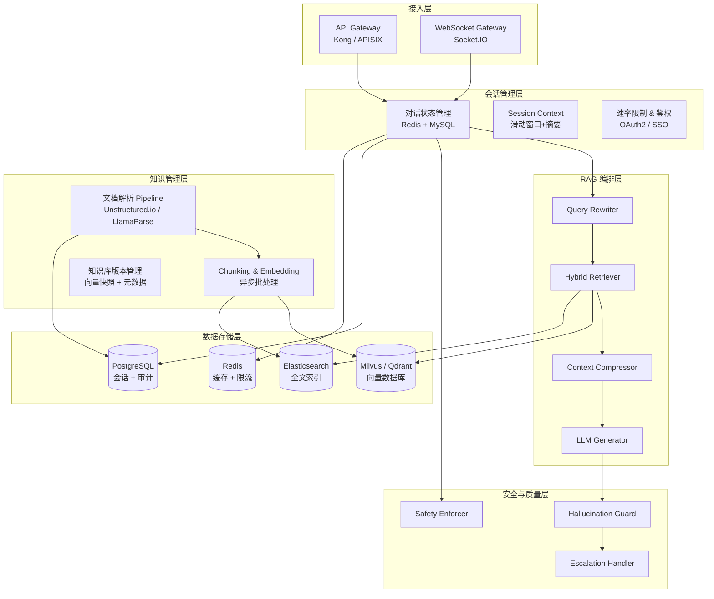
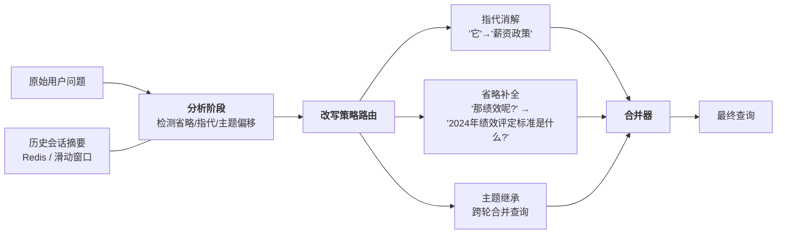
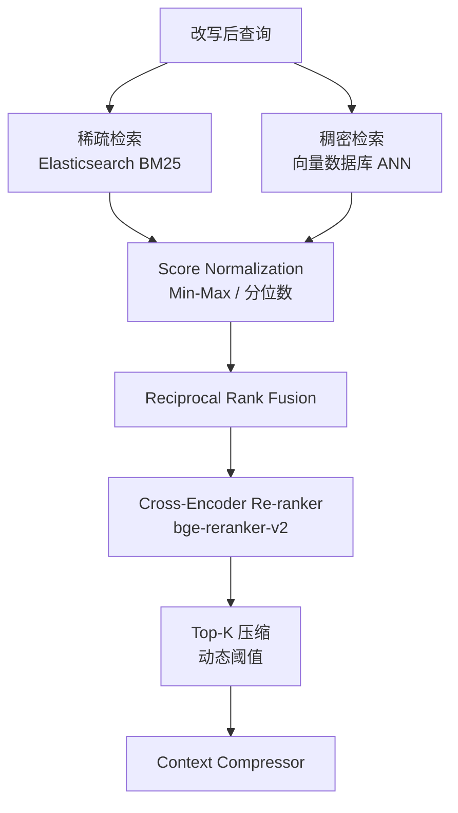
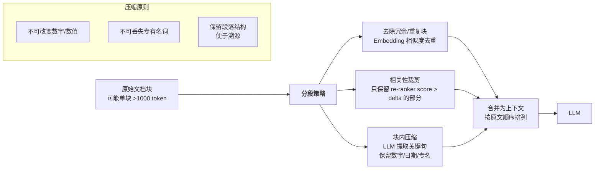
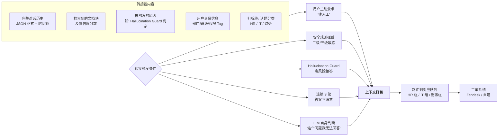
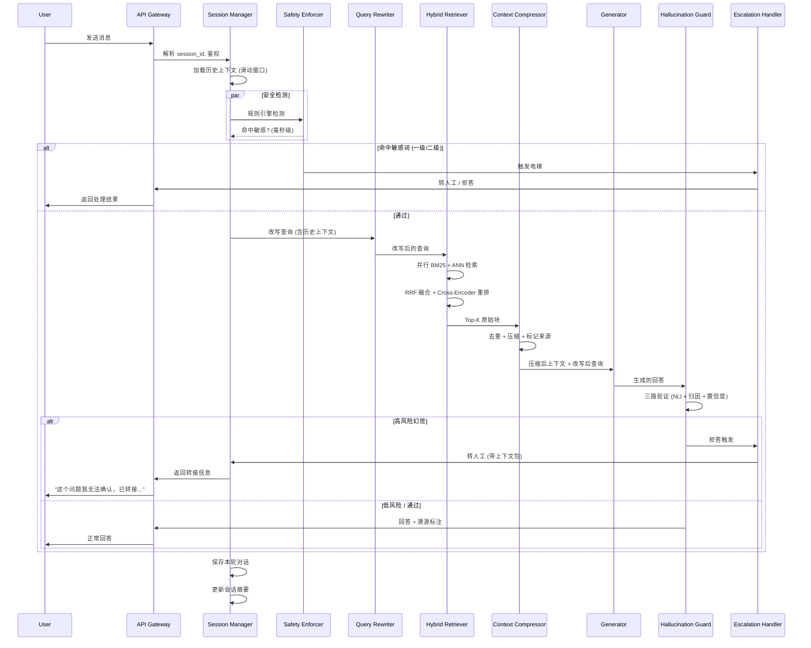
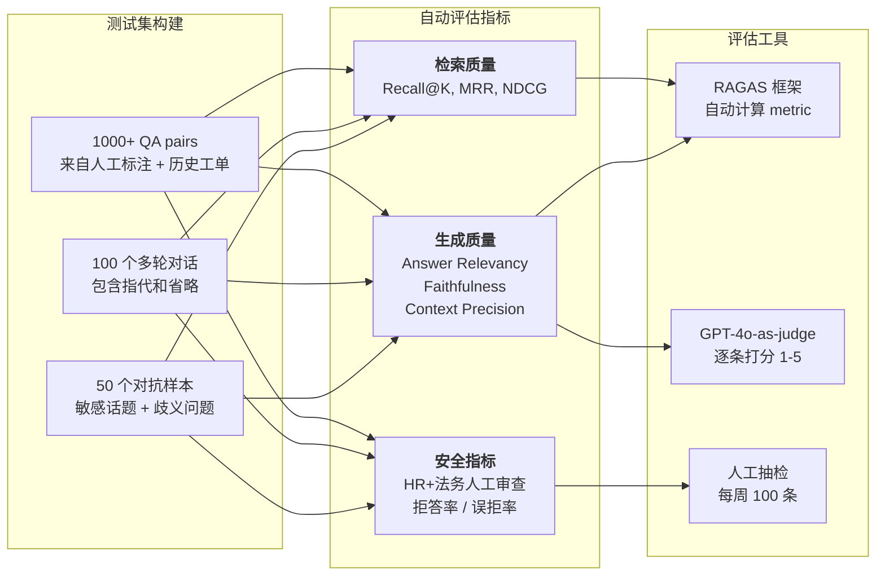
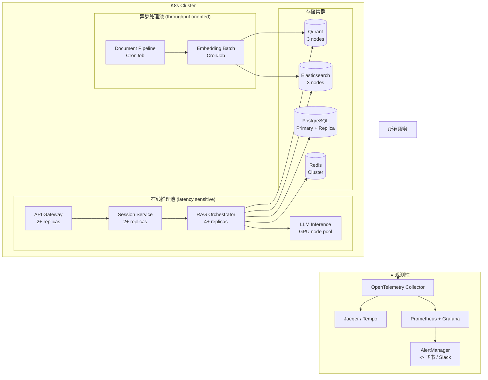

# 企业级 RAG 客服系统 - 整体架构设计

> 文档版本: v1.0 | 日期: 2026-06-13 | 作者: AI Agent + 架构师

---

## 1. 系统分层架构

整个系统按"关注点分离"原则分为六层，每层只依赖下一层，通过明确的 API 契约通信。



**为什么这样分层：**

- **接入与会话分离**：API Gateway 处理协议适配和限流，会话层单独管理状态，便于多端复用（Web / Slack / 企业微信）。
- **RAG 编排与安全层分离**：编排层只关心"怎么能检索得更准"，安全层只关心"能不能回答"，修改一方不影响另一方。
- **知识管理独立分层**：文档处理的异步 pipeline 与在线推理路径解耦，避免文档更新拖慢问答延迟。

---

## 2. 核心模块与职责

### 2.1 Query Rewriter -- 多轮对话的上下文理解



**设计理由：**

- 使用 **N-shot prompt + 规则兜底** 而非单独微调一个重写模型。原因是改写逻辑变更频繁，用 prompt 可以快速调整策略，且 LLM 在改写任务上的表现已经足够好。
- **滑动窗口+摘要混合**：最近 N 轮完整保留，超出窗口的用 LLM 压缩为一句话摘要注入 prompt，避免 token 膨胀。
- 改写后的查询会同时传给检索和生成两个路径——检索用改写后查询，生成时则附加改写前后的对比说明，让 LLM 知道问题经过了改写，减少困惑。

### 2.2 Hybrid Retriever -- 混合检索与结果融合



**核心设计决策：**

| 组件 | 方案 | 理由 |
|---|---|---|
| 稀疏检索 | BM25（ES） | 精确关键词匹配在"政策编号""员工姓名"等场景不可替代 |
| 稠密检索 | bge-m3 / intfloat 模型 | 支持多语言+多粒度，且可输出稠密/稀疏两种向量 |
| 结果融合 | **Reciprocal Rank Fusion** | 对分数分布不敏感，比加权平均更鲁棒 |
| 重排序 | **Cross-Encoder** | 只对 Top-100 做重排，计算量可控（O(n) vs O(n²)），精度比双编码器高 5-10% |
| 动态 Top-K | 置信度阈值 + 最少 3 块 | 防止无结果时不返回，也防止低质量结果污染上下文 |

**为什么不用 Cohere Rerank 或 OpenAI：** 数据不出企业内网是很多公司的合规要求，bge 系列可本地部署，控制权完全在自己。

### 2.3 Context Compressor -- 检索结果压缩



**设计理由：**

- 分两层：第一层用**规则+Embedding 去重**（O(n)），第二层对保留下来的块用 LLM **提取式压缩**（抽取关键句而非重写摘要，避免"插值幻觉"）。
- 数字、日期、专有名词通过 **NER 标记 + 正则保护**，压缩时禁止模型修改这些 token。
- 保留每个压缩块对原文的 **chunk_id + page_number** 引用，支撑后面的"溯源高亮"。

### 2.4 Hallucination Guard -- 幻觉检测与防护

```mermaid
flowchart TB
    Q[用户问题] --> GEN[LLM 生成回答]
    GEN --> CHECK{三路交叉验证}

    CHECK --> V1["Factual Consistency<br/>NLI 模型评估<br/>回答是否蕴含检索上下文"]
    CHECK --> V2["Source Attribution<br/>每个 claim 是否有<br/>对应的文档块"]
    CHECK --> V3["Uncertainty Detection<br/>logprob 分析<br/>低置信度标记"]

    V1 -- 不蕴含 --> FLAG[标记可疑]
    V2 -- 无来源 --> FLAG
    V3 -- 低置信 --> FLAG

    FLAG --> DECIDE{严重程度}

    DECIDE -->|高风险| REJECT["拒答<br/>'抱歉，我无法确认...'"]
    DECIDE -->|低风险| WARN["警告标注<br/>'以下内容可能存在偏差' + <br/>溯源高亮"]

    V1 & V2 & V3 -- 全部通过 --> PASS[正常回答 + 溯源脚注]

    subgraph "溯源高亮机制"
        direction TB
        H1[回答句子末尾标注 [1][2]]
        H2["消息下方显示引用卡片<br/>点击展开原文片段"]
        H3["卡片包含: chunk_id, 文档名, 置信度"]
    end
```

**设计理由：**

- 不是单一模型判断是否幻觉，而是 **三路并行的信号**：NLI 模型（如 Alibaba-NLP/gte-Qwen2）判断语义蕴含，归因检测检查每个 claim 是否能在检索结果中找到对应，logprob 分析捕捉模型自身的不确定性。
- 三路信号综合决策，比任何单一方法都可靠。误报（把正确回答判为幻觉）比漏报严重，所以阈值设保守——宁可标记低风险警告，也不要错误拒答。
- 溯源高亮既是用户体验措施，也是质量控制手段：用户看到引用可以自行判断，也为后续人工审核提供依据。

### 2.5 Safety Enforcer -- 安全检测与拦截

```
检测流程（两阶段）：

阶段一 —— 快速规则引擎（毫秒级）
  +------------------------------------------+
  |  敏感词库（正则 + 精确匹配）              |
  |  - 薪资相关: 工资/奖金/股权               |
  |  - 人事敏感: 裁员/优化/降薪               |
  |  - 法律合规: 举报/诉讼/调查中              |
  |  命中 → 直接转人工，不经过 RAG            |
  +------------------------------------------+

阶段二 —— LLM 语义分级（并行，异步）
  +------------------------------------------+
  |  LLM 对问题分级（0-3四级）                |
  |  0: 完全安全 → 正常流程                   |
  |  1: 边缘话题 → 回答后追加免责声明          |
  |  2: 敏感话题 → 回答经人工审核后发出        |
  |  3: 违规话题 → 直接拒答 + 转人工          |
  +------------------------------------------+
```

**设计理由：**

- 规则引擎在前（毫秒级），LLM 分级在后（异步并行），避免纯 LLM 判断带来的延迟和成本。
- 分级策略不是简单的"通过/拦截"：二级话题走"人工审核后发出"，比直接拦截更柔性，也保留审计痕迹。
- 敏感词库需要定期更新，由 HR / 法务提供初始列表，运营团队维护。

### 2.6 Escalation Handler -- 人工转接



**设计理由：**

- 上下文打包是最容易被低估的环节。客服收到转接时如果只有一句"用户对薪资有疑问"，他需要重新问一遍，体验极差。所以打包内容要**足够让接手的客服不需要重复提问**。
- 转接触发条件不仅是"用户说转人工"，系统应该**主动判断**——这来自三个信号的综合：安全规则、幻觉防护、用户的满意度反馈（连续不满意轮数）。

---

## 3. 数据流 -- 完整生命周期



---

## 4. 技术选型建议

| 层级 | 选型 | 备选 | 选择理由 |
|---|---|---|---|
| **向量数据库** | **Qdrant** | Milvus / Weaviate | 部署简单（单二进制），支持过滤索引，与 LangChain/LlamaIndex 集成好；Milvus 更适合超大规模（>1亿向量） |
| **全文检索引擎** | **Elasticsearch** | Meilisearch | 生态成熟，BM25 实现标准，与公司已有 ELK 栈可复用 |
| **嵌入模型** | **BGE-M3 (BAAI/bge-m3)** | intfloat/multilingual-e5-large-instruct | 支持稠密+稀疏+多向量输出，多语言（中文 > 英文），MIT 许可，可私有部署 |
| **重排序模型** | **BAAI/bge-reranker-v2-m3** | Cohere Rerank API | 与 BGE-M3 同生态，延迟可控（<200ms 处理 Top-100），可本地部署 |
| **生成模型** | **DeepSeek-V3 / Qwen2.5-72B**（自部署）或 GPT-4o（API） | -- | 自部署走私有化路线，API 路线走快速验证；中文能力都足够强 |
| **NLI 幻觉检测** | **Alibaba-NLP/gte-Qwen2-7B-instruct** | NLI 专用模型（如 DeBERTa-v3） | 7B 做判断比小模型更可靠，且与生成模型同语系 |
| **编排框架** | **LangGraph (自定状态机)** | LlamaIndex / Haystack | RAG 流程有复杂分支（转接、拒答、重试），状态机比 DAG 更可表达 |
| **文档解析** | **LlamaParse + Unstructured.io** | Azure Document Intelligence | 支持复杂格式（PDF 表格、多栏布局） |
| **缓存** | **Redis** (回答缓存 + 会话状态) | -- | 回答缓存对重复问题（如"年假几天"）命中率极高，可减少 40%+ LLM 调用 |
| **消息队列** | **RabbitMQ / Redis Stream** | -- | 异步文档处理 pipeline 的解耦 |

---

## 5. 质量评估体系

### 5.1 离线评估



**关键指标：**

- **检索命中率（Hit Rate@K）**：被最后采纳的回答覆盖的文档块是否在检索的 Top-K 中。这是最直接的检索质量指标。
- **回答忠实度（Faithfulness）**：生成的回答是否完全基于检索到的上下文，没有添加额外信息。用 NLI 模型自动评估。
- **幻觉率（Hallucination Rate）**：手动标记每 100 条回答中，有多少条包含幻觉。目标 <3%。
- **误拒率（False Rejection Rate）**：本可以安全回答的问题被 Hallucination Guard 误判为幻觉的比例。目标 <1%。
- **转接准确率**：触发人工转接的案例中，真正需要人工的比例。目标 >80%。

### 5.2 在线 A/B 测试

```
实验设计框架：

+----------------------------------------------------------+
|  流量分层: user_id hash 路由，同用户始终在同实验组        |
|                                                          |
|  A 组 (对照组): 当前生产版本                              |
|  B 组 (实验组): 新检索策略 / 新 prompt / 新模型          |
|                                                          |
|  核心观测指标:                                            |
|  - 回答采纳率（用户手动点赞/踩/复制行为）                 |
|  - 人工转接率                                             |
|  - 平均处理时长                                           |
|  - 二次提问率（同一会话内同主题重复提问）                 |
|                                                          |
|  运行时长: 至少 7 天，覆盖完整工作周                      |
|  显著判定: p < 0.05，最小样本量 ~5000/组                 |
+----------------------------------------------------------+
```

**设计理由：**

- 离线指标和在线指标往往不一致。离线 Faithfulness 高不代表用户满意。所以离线用来筛选候选方案，在线 A/B 做最终决策。
- 不只看"点赞率"，还要看"二次提问率"——用户对回答不满意但没说"不喜欢"，可能是继续追问同一个问题，这个指标更能反映真实体验。
- 统计显著性设置 p<0.05 而非 0.01，是因为 RAG 系统的改进通常是渐进式的，太严格的标准会错过真阳性。

---

## 6. 部署与可观测性

### 6.1 全链路追踪

```
每个请求生成唯一的 trace_id，贯穿以下所有节点：

用户请求
  |
  +--[API Gateway]----------> access_log + latency
  +--[Session Manager]-------> session_id + context_size
  +--[Safety Enforcer]-------> rule_hit + decision (pass/reject/escalate)
  +--[Query Rewriter]--------> original_query -> rewritten_query
  +--[Hybrid Retriever]------> sparse_score, dense_score, fusion_rank
  |                           -> re-ranker score per chunk
  +--[Context Compressor]----> input_tokens -> output_tokens, compression_ratio
  +--[LLM Generator]---------> model_name, prompt_tokens, completion_tokens
  |                           -> first_token_latency, total_latency
  +--[Hallucination Guard]---> nli_score, attribution_score, logprob_avg
  |                           -> verdict (pass/warn/reject)
  +--[User Feedback]---------> reaction (like/dislike), follow_up_question

全部写入 OpenTelemetry -> Jaeger / Grafana Tempo
```

### 6.2 关键监控指标与报警

| 指标 | 计算方式 | P99 目标 | 报警阈值 |
|---|---|---|---|
| **P99 端到端延迟** | trace duration | < 5s | > 8s 持续 5min |
| **检索 P99 延迟** | BM25 + ANN + Rerank | < 1.5s | > 3s |
| **LLM 首 token 延迟** | 生成模型 first token | < 1s (流式) | > 3s |
| **召回率 (Recall@10)** | 离线/在线跟踪 | > 90% | < 80% |
| **幻觉率** | NLI 判断 + 人工抽检 | < 3% | > 5% 持续 1d |
| **误拒率** | NLI 应为 pass 却被 reject | < 1% | > 3% |
| **转接率** | escalated / total | 5-15% | > 25% 或 < 2% |
| **每日 LLM Token 消耗** | 按模型汇总 | 设定预算 | > 预算 120% |
| **用户满意度 (Like/Total)** | 用户手动反馈 | > 85% | < 70% |

### 6.3 部署拓扑（简化）



---

## 总结：这个架构的设计哲学

1. **安全是架构问题，不是 feature**：Safety Enforcer 和 Hallucination Guard 嵌入在 RAG pipeline 的固定节点，不是事后补丁。每个回答都经过"检索->生成->验证->放行"的完整闭环，没有旁路。

2. **分层而非大单体**：每个核心职责独立为模块（重写、检索、压缩、生成、检测、转接），任何一个模块可以独立升级、回滚、A/B 测试。

3. **多信号而非单点判断**：从检索融合（RRF）到幻觉检测（三路验证），每个决策节点都综合多个信号，避免单一模型的盲区。

4. **可审计是生产系统的基本要求**：全链路 trace 保证每个回答都可以追溯到"用了哪些文档块->模型怎么生成的->安全检测怎么判的"，这对企业合规是刚需。

---

> 后续可展开的深入方向：
> - Query Rewriter 的 prompt 工程设计
> - Hybrid Retriever 的 Score 融合公式
> - Hallucination Guard 的 NLI 模型微调方案
> - 安全词库的管理与更新流程
> - 各模块的 API 契约定义

---

> 最后更新: 2026-06-13
> 文档版本: v1.0
