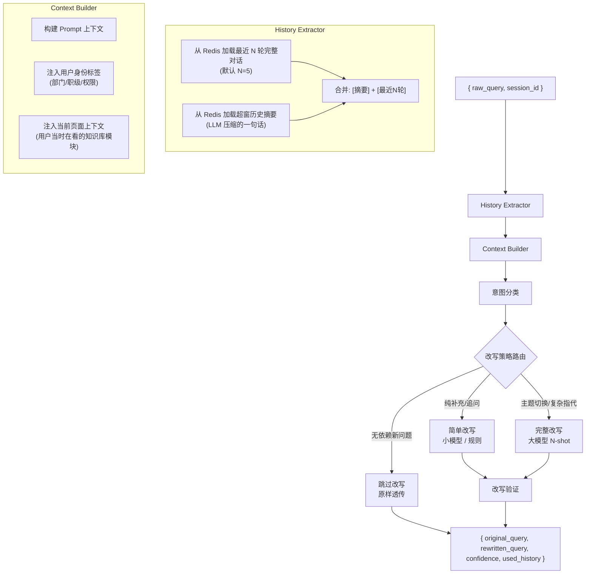

# Query Rewriter - 详细工程设计

> 负责多轮对话中的查询改写，解决指代消解、省略补全、主题继承等问题。

---

## 1. 为什么需要 Query Rewriter？

用户在多轮对话中自然省略上下文：

```
第1轮: "年假有几天？"
第2轮: "那病假呢？"       ← 省略了"有几天"，指代"休假政策"主题
第3轮: "我要怎么申请？"    ← 继承第2轮主题，"申请"的宾语是"病假"
```

如果不做改写，第3轮直接检索到的会是"各类申请流程"，而非"病假申请流程"。

## 2. 架构设计



## 3. Prompt 工程设计

### 3.1 完整改写 Prompt（用于复杂场景）

```
你是一个查询改写专家。你需要根据对话历史，将用户的当前问题改写为一个独立、完整的检索查询。

【改写规则】
1. 将代词（它、他们、那个）替换为明确的实体名称。
2. 将省略的部分补齐。例如"那A呢？"应改为"那A的[B]呢？"，其中[B]来自历史中最近被提问的属性。
3. 保留用户的原始语气和意图，不要添加用户没说过的信息。
4. 如果问题中出现了与历史主题完全不同的新主题，保持原样，不要强行关联。
5. 改写后的问题应该是一个自然的中文句子，可以直接用于搜索引擎检索。

【用户身份】
部门: {user_department}
职级: {user_level}
当前浏览页面: {current_page}

【对话历史】
{conversation_history}

【当前问题】
{raw_query}

【输出格式】
请严格按照以下 JSON 格式输出：
{
  "rewritten_query": "改写后的完整问题",
  "strategy": "coreference | ellipsis | inherit | passthrough",
  "confidence": 0.0-1.0,
  "reasoning": "简短说明为什么做了这些改写"
}
```

### 3.2 意图分类 Prompt（路由用，用更小更快的模型）

```
判断以下问题的类型：

对话历史：{history_summary}
当前问题：{raw_query}

分类：
- SUPPLEMENT: 对上一轮问题的补充或追问（如"那...呢？"、"还有吗？"）
- SWITCH: 完全新的话题，与历史无关
- SIMPLE_COREF: 仅包含简单指代（如"它"、"这个"）
- COMPLEX: 复杂指代或多层省略

只输出类别名称。
```

## 4. 上下文管理策略

### 4.1 滑动窗口 + 摘要混合

```
Redis Key: session:{session_id}:context
数据结构: JSON

{
  "full_rounds": [           // 最近 N 轮完整对话
    {
      "round_id": 5,
      "user_query": "年假有几天？",
      "assistant_answer": "根据公司政策，年假...",
      "timestamp": 1718200000,
      "topics": ["休假", "年假"]
    },
    ...
  ],
  "summary": "用户正在咨询休假政策，上一轮问到年假天数，当前关注病假。",
  "last_topic": "休假政策",
  "session_started": 1718200000,
  "total_rounds": 8
}
```

### 4.2 摘要生成策略（触发时机）

```
触发条件（任一满足即更新摘要）:
1. 累计 10 轮对话未更新摘要
2. 用户切换到与历史不同的新主题
3. full_rounds 超出 N 轮，需要淘汰最旧的一轮

摘要生成 Prompt:
"请用一段话（不超过80字）总结以下对话的核心内容和当前状态：
{对话内容}
只保留：用户身份、当前关注的主题、最近讨论的具体内容、是否有未解决的问题。"
```

### 4.3 为什么不用自动摘要模型？

- RAG 上下文需要精确信息（比如"用户上一轮问了绩效评定标准"），通用摘要模型容易丢失细节。
- 用生成模型做摘要可以控制摘要的粒度（80字以内），且可以定制摘要的重点（"重点关注数字、日期、政策名称"）。

## 5. 核心算法伪代码

```python
from dataclasses import dataclass
from typing import Optional
import json
import hashlib

@dataclass
class RewrittenQuery:
    original: str
    rewritten: str
    strategy: str  # "coreference" | "ellipsis" | "inherit" | "passthrough"
    confidence: float
    used_history_rounds: list[int]

class QueryRewriter:
    def __init__(self, redis_client, llm_full, llm_lite, config):
        self.redis = redis_client
        self.llm_full = llm_full     # 大模型 (完整改写)
        self.llm_lite = llm_lite     # 小模型 (意图分类)
        self.max_full_rounds = config.get("max_full_rounds", 5)
        self.summary_max_chars = config.get("summary_max_chars", 80)
        self.cache_ttl = config.get("cache_ttl", 3600)  # 1小时

    async def rewrite(self, raw_query: str, session_id: str,
                      user_context: dict) -> RewrittenQuery:
        # 1. 尝试缓存命中
        cache_key = self._cache_key(raw_query, session_id)
        cached = await self.redis.get(cache_key)
        if cached:
            return RewrittenQuery(**json.loads(cached))

        # 2. 加载会话上下文
        ctx = await self._load_context(session_id)

        # 3. 如果没有历史，直接透传
        if not ctx["full_rounds"]:
            return RewrittenQuery(
                original=raw_query,
                rewritten=raw_query,
                strategy="passthrough",
                confidence=1.0,
                used_history_rounds=[]
            )

        # 4. 意图分类（用小模型）
        intent = await self._classify_intent(raw_query, ctx)

        # 5. 路由改写
        if intent == "SUPPLEMENT" or intent == "SIMPLE_COREF":
            result = await self._rewrite_simple(raw_query, ctx)
        elif intent == "COMPLEX":
            result = await self._rewrite_full(raw_query, ctx, user_context)
        else:  # SWITCH
            result = RewrittenQuery(
                original=raw_query,
                rewritten=raw_query,
                strategy="passthrough",
                confidence=1.0,
                used_history_rounds=[]
            )

        # 6. 验证改写质量
        result = await self._validate(result, raw_query)

        # 7. 缓存结果
        await self.redis.setex(cache_key, self.cache_ttl,
                               json.dumps(result.__dict__))

        return result

    async def _classify_intent(self, raw_query: str, ctx: dict) -> str:
        """用小模型做快速意图分类"""
        prompt = INTENT_CLASSIFY_PROMPT.format(
            history_summary=ctx.get("summary", ""),
            raw_query=raw_query
        )
        response = await self.llm_lite.generate(prompt, max_tokens=10)
        return response.strip()

    async def _rewrite_full(self, raw_query: str, ctx: dict,
                            user_context: dict) -> RewrittenQuery:
        """大模型完整改写"""
        history_text = self._format_history(ctx)
        prompt = REWRITE_FULL_PROMPT.format(
            user_department=user_context.get("department", "未知"),
            user_level=user_context.get("level", "未知"),
            current_page=user_context.get("current_page", "未知"),
            conversation_history=history_text,
            raw_query=raw_query
        )
        response = await self.llm_full.generate(prompt, max_tokens=200)

        try:
            parsed = json.loads(response)
        except json.JSONDecodeError:
            # 解析失败，降级为透传
            return RewrittenQuery(
                original=raw_query,
                rewritten=raw_query,
                strategy="passthrough",
                confidence=0.5,
                used_history_rounds=[]
            )

        used_rounds = [r["round_id"] for r in ctx["full_rounds"]]
        return RewrittenQuery(
            original=raw_query,
            rewritten=parsed["rewritten_query"],
            strategy=parsed["strategy"],
            confidence=parsed["confidence"],
            used_history_rounds=used_rounds
        )

    async def _validate(self, result: RewrittenQuery,
                        raw_query: str) -> RewrittenQuery:
        """验证改写质量，防止过度改写或语义漂移"""

        # 规则检查
        if result.rewritten == raw_query:
            return result  # 没改，直接通过

        # 检查改写后是否丢失了原始查询的关键信息
        if not self._contains_core_info(raw_query, result.rewritten):
            # 降级为透传
            result.rewritten = raw_query
            result.strategy = "passthrough"
            result.confidence = 0.3

        return result

    def _contains_core_info(self, original: str, rewritten: str) -> bool:
        """检查改写后是否保留了原始查询中的命名实体和关键词"""
        # 提取原始查询中的专有名词和数字
        import re
        patterns = [
            r'\d+[年月日号]?',   # 日期/数字
            r'[A-Z]+\d*',         # 英文缩写
            r'[\u4e00-\u9fff]{2,6}(?:政策|制度|流程|标准|规定)'  # 政策类专名
        ]
        for pattern in patterns:
            matches = re.findall(pattern, original)
            for m in matches:
                if m not in rewritten:
                    return False
        return True

    def _format_history(self, ctx: dict) -> str:
        """格式化对话历史为文本"""
        lines = []
        if ctx.get("summary"):
            lines.append(f"[历史摘要] {ctx['summary']}\n")

        for i, r in enumerate(ctx.get("full_rounds", [])):
            lines.append(f"第{i+1}轮:")
            lines.append(f"  用户: {r['user_query']}")
            lines.append(f"  助手: {r['assistant_answer'][:200]}...")
        return "\n".join(lines)

    def _cache_key(self, raw_query: str, session_id: str) -> str:
        h = hashlib.md5(f"{session_id}:{raw_query}".encode()).hexdigest()
        return f"qrewrite:{h}"
```

## 6. 边界情况与降级策略

| 边界情况 | 降级策略 |
|---|---|
| 大模型超时 (3s) | 小模型兜底改写，再超时则透传 |
| JSON 解析失败 | 解析失败 -> 透传原始查询，不阻塞请求 |
| 改写后丢失关键信息 | 规则检测 -> 回退到原始查询 |
| 历史上下文为空 | 直接透传，confidence=1.0 |
| 用户连续快速灌水 | 去重检测 -> 如果与上轮完全相同，直接复用上次改写 |
| 改写后查询过长 (>512 chars) | 截断到 512 字符，保留首尾关键信息 |

## 7. 性能指标

| 指标 | 目标值 | 备注 |
|---|---|---|
| 意图分类延迟 (P99) | < 200ms | 使用 7B 以下小模型 |
| 完整改写延迟 (P99) | < 800ms | 使用 70B 级模型 |
| 缓存命中率 | > 30% | 同 session 内相同问题 |
| 改写准确率 (人工评估) | > 90% | 抽样 100 条评估改写是否保留了原始意图 |
| 过度改写率 | < 5% | 本应透传却被改写 |

## 8. API 契约

```
POST /api/v1/query/rewrite

Request:
{
  "raw_query": "那绩效呢？",
  "session_id": "sess_abc123",
  "user_context": {
    "department": "研发部",
    "level": "P6",
    "current_page": "/wiki/hr/leave-policy"
  }
}

Response:
{
  "original_query": "那绩效呢？",
  "rewritten_query": "2024年绩效评定的标准是什么？",
  "strategy": "ellipsis",
  "confidence": 0.92,
  "used_history_rounds": [1, 2, 3],
  "latency_ms": 450
}
```

---

> 继续阅读: [03-hybrid-retriever.md](03-hybrid-retriever.md)
