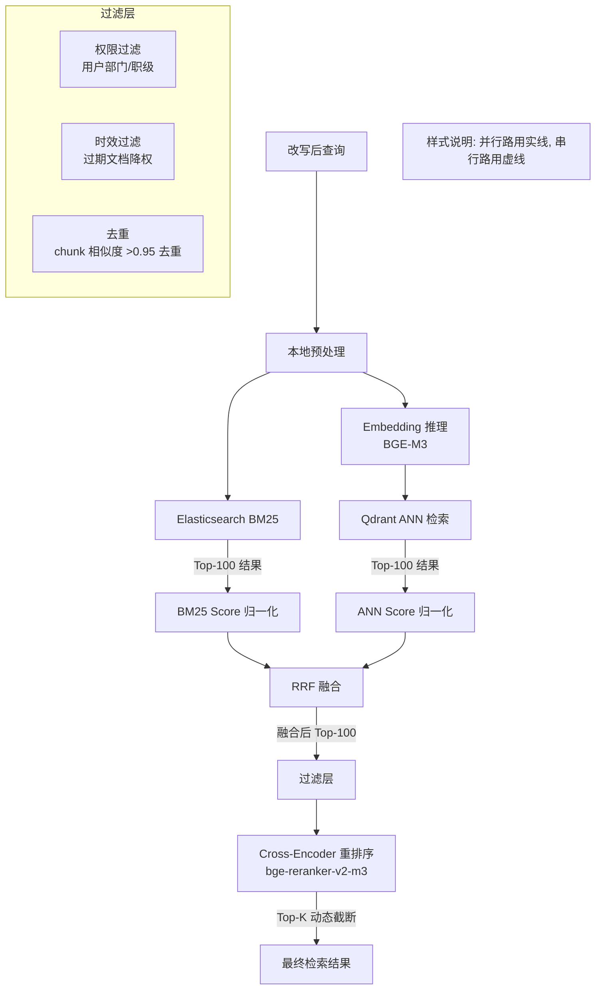

# Hybrid Retriever - 详细工程设计

> 混合检索策略：BM25 + ANN 双路召回 -> 分数归一化 -> Reciprocal Rank Fusion -> Cross-Encoder 重排序。

---

## 1. 为什么需要 Hybrid Retriever？

单一检索方式的盲区：

| 场景 | 纯 BM25 | 纯向量检索 | Hybrid |
|---|---|---|---|
| "年假有几天？" vs "带薪休假天数" | 召不回 | 能召回 | 双保险 |
| 精确查询 "HR-POL-2024-003" | 能召回 | 召不回 | 双保险 |
| "报销流程最后一步是什么？" | 噪音多 | 精度高 | 互补 |

BM25 擅长精确匹配（编号、人名），向量检索擅长语义匹配（近义词、改写），两者必须融合。

## 2. 核心架构



## 3. 分数归一化算法

两路分数分布差异很大（BM25 天然无上界，ANN 余弦分数在 0-1 之间），必须归一化。

### 3.1 方案对比

```python
# === 方案 A: Min-Max 归一化（对离群值敏感） ===
def min_max_normalize(scores: list[float]) -> list[float]:
    min_s = min(scores)
    max_s = max(scores)
    if max_s == min_s:
        return [0.5] * len(scores)
    return [(s - min_s) / (max_s - min_s) for s in scores]

# === 方案 B: 分位数映射到固定分桶（推荐） ===
def quantile_normalize(scores: list[float], num_buckets: int = 10) -> list[float]:
    """将分数按分位数映射到 [0, 1] 区间，对长尾分布更鲁棒"""
    import numpy as np

    if len(scores) < num_buckets:
        # 样本不足时分桶，退化为 min-max
        return min_max_normalize(scores)

    sorted_indices = np.argsort(scores)
    ranks = np.empty_like(sorted_indices)
    ranks[sorted_indices] = np.arange(len(scores))

    # 分桶映射
    normalized = ranks.astype(float) / (len(scores) - 1)
    return normalized.tolist()
```

### 3.2 选择方案 B 的理由

- BM25 分数的分布往往是长尾的（少数结果分数极高，多数极低），Min-Max 归一化会让 90% 的结果挤在 0.1 以下，失去区分度。
- 分位数归一化让分数分布均匀化，每路结果在融合时贡献的比例更平衡。

## 4. Reciprocal Rank Fusion (RRF)

### 4.1 公式

```
RRF_score(d) = sum_over_k ( 1 / (k + rank_k(d)) )
```

其中：
- `d` 是文档/块
- `k` 是检索通路索引（BM25、ANN）
- `rank_k(d)` 是文档 `d` 在第 `k` 路结果中的排名（从 1 开始）
- 常数 `k` 通常设为 60，用于平滑排名差异

### 4.2 Python 实现

```python
def reciprocal_rank_fusion(
    bm25_results: list[tuple[str, float]],   # [(chunk_id, bm25_score), ...]
    ann_results: list[tuple[str, float]],     # [(chunk_id, ann_score), ...]
    k: int = 60
) -> list[tuple[str, float]]:
    """RRF 融合两路检索结果"""

    # 先做分位数归一化
    bm25_ids = [x[0] for x in bm25_results]
    ann_ids = [x[0] for x in ann_results]

    bm25_norm = quantile_normalize([x[1] for x in bm25_results])
    ann_norm = quantile_normalize([x[1] for x in ann_results])

    # 按归一化分数降序排列
    bm25_ranked = sorted(
        zip(bm25_ids, bm25_norm), key=lambda x: x[1], reverse=True
    )
    ann_ranked = sorted(
        zip(ann_ids, ann_norm), key=lambda x: x[1], reverse=True
    )

    # 计算 RRF 分数
    scores: dict[str, float] = {}
    for rank, (chunk_id, _) in enumerate(bm25_ranked, start=1):
        scores[chunk_id] = scores.get(chunk_id, 0) + 1.0 / (k + rank)
    for rank, (chunk_id, _) in enumerate(ann_ranked, start=1):
        scores[chunk_id] = scores.get(chunk_id, 0) + 1.0 / (k + rank)

    # 按 RRF 分数降序排列，取前 100
    sorted_chunks = sorted(scores.items(), key=lambda x: x[1], reverse=True)
    return sorted_chunks[:100]
```

### 4.3 为什么用 RRF 而不是加权求和？

- RRF 不依赖原始分数的尺度，分数归一化做不好也不影响结果（它只关心排名）。
- 权重隐含在 `k` 参数里：如果某路检索更可靠，可以调整 `k` 值（比如 BM25 路用 `k1=30`，ANN 路用 `k2=90`，表示 BM25 排名权重更高）。
- 实践中最简单也最鲁棒——在很多检索评测中 RRF 的稳定性和结果都优于线性插值。

## 5. 过滤层

### 5.1 权限过滤

```python
async def _filter_by_permissions(self, chunks, user_context):
    """根据用户权限过滤文档"""
    user_dept = user_context["department"]
    user_level = user_context["level"]

    allowed = []
    for chunk_id, score in chunks:
        metadata = await self.metadata_store.get(chunk_id)
        # 检查文档访问权限
        if not self._has_access(metadata, user_dept, user_level):
            continue
        allowed.append((chunk_id, score))
    return allowed

def _has_access(self, metadata, dept, level):
    access = metadata.get("access_control", {})
    allowed_depts = access.get("departments", [])
    allowed_levels = access.get("min_level", 0)

    if allowed_depts and dept not in allowed_depts:
        return False
    if level < allowed_levels:
        return False
    return True
```

### 5.2 时效性降权

```python
def apply_temporal_decay(self, chunks, current_date):
    """对过期或过旧的文档降权（不是硬删除）"""
    import datetime

    decayed = []
    for chunk_id, score in chunks:
        metadata = self.metadata_store.get(chunk_id)
        published = metadata.get("published_date")
        expires = metadata.get("expires_date")

        decay_factor = 1.0

        if expires and current_date > expires:
            # 已过期：直接删除
            continue

        if published:
            age_days = (current_date - published).days
            if age_days > 365:
                # 超过一年的文档，权重降低到 0.7
                decay_factor = max(0.5, 1.0 - (age_days - 365) * 0.001)

        decayed.append((chunk_id, score * decay_factor))
    return decayed
```

### 5.3 Embedding 去重

```python
def deduplicate_by_embedding(self, chunks, threshold=0.95):
    """对高相似度的 chunk 对进行去重，保留分数更高的"""
    if len(chunks) <= 1:
        return chunks

    # 获取所有 chunk 的 embedding（缓存优先）
    embeddings = {cid: self._get_embedding(cid) for cid, _ in chunks}

    seen = set()
    deduped = []

    for chunk_id, score in chunks:
        is_dup = False
        for seen_id in seen:
            sim = cosine_similarity(embeddings[chunk_id], embeddings[seen_id])
            if sim > threshold:
                is_dup = True
                break

        if not is_dup:
            seen.add(chunk_id)
            deduped.append((chunk_id, score))

    return deduped
```

## 6. Cross-Encoder 重排序

### 6.1 原理

双编码器（Bi-Encoder）将查询和文档独立编码为向量后计算相似度，速度快但精度有损。Cross-Encoder 将查询和文档**拼接后一起编码**，充分交互，精度显著更高，但计算量大。

因此策略是：
1. 双编码器召回 Top-100（粗筛）
2. Cross-Encoder 对 Top-100 重排（精排）

### 6.2 实现

```python
class CrossEncoderReranker:
    def __init__(self, model_path: str, batch_size: int = 32,
                 max_length: int = 512, device: str = "cuda"):
        from sentence_transformers import CrossEncoder
        self.model = CrossEncoder(model_path, device=device)
        self.batch_size = batch_size
        self.max_length = max_length

    def rerank(self, query: str, chunks: list[tuple[str, str, float]]
               ) -> list[tuple[str, str, float]]:
        """
        Args:
            query: 改写后的查询文本
            chunks: [(chunk_id, chunk_text, pre_score), ...] — RRF 融合后结果

        Returns:
            [(chunk_id, chunk_text, rerank_score), ...] 按 rerank_score 降序
        """
        # 构造 (query, document) 对
        pairs = [[query, chunk_text] for _, chunk_text, _ in chunks]

        # 批量推理
        scores = self.model.predict(
            pairs,
            batch_size=self.batch_size,
            show_progress_bar=False,
            convert_to_tensor=True
        )

        # 关联回原始结果
        ranked = []
        for (chunk_id, chunk_text, pre_score), new_score in zip(chunks, scores):
            ranked.append((chunk_id, chunk_text, float(new_score)))

        ranked.sort(key=lambda x: x[2], reverse=True)
        return ranked
```

### 6.3 动态 Top-K 截断

```python
def dynamic_top_k(self, reranked: list, min_k: int = 3, max_k: int = 20,
                   score_threshold: float = 0.3,
                   drop_threshold: float = 0.5) -> list:
    """动态决定返回多少个 chunk"""
    if not reranked:
        return []

    best_score = reranked[0][2]

    # 方法1: 分数阈值 — 保留分数 >= best_score * 0.5 的
    by_threshold = [
        c for c in reranked if c[2] >= best_score * drop_threshold
    ]

    # 方法2: 分数跳跃点截断
    cutoff_k = len(reranked)
    for i in range(1, len(reranked)):
        drop_ratio = reranked[i][2] / reranked[i-1][2]
        if drop_ratio < 0.6:  # 分数断崖式下跌
            cutoff_k = i
            break

    # 综合决策
    final_k = min(cutoff_k, len(by_threshold))
    final_k = max(final_k, min_k)
    final_k = min(final_k, max_k)

    return reranked[:final_k]
```

## 7. Elasticsearch BM25 查询模板

```json
{
  "query": {
    "bool": {
      "must": [
        {
          "multi_match": {
            "query": "{rewritten_query}",
            "fields": ["title^3", "content^2", "keywords^5", "summary^1"],
            "type": "best_fields",
            "tie_breaker": 0.3
          }
        }
      ],
      "filter": [
        { "term": { "status": "published" } },
        { "range": { "effective_date": { "lte": "now" } } }
      ],
      "must_not": [
        { "term": { "status": "archived" } }
      ]
    }
  },
  "size": 100,
  "_source": ["chunk_id", "doc_id", "content", "title", "page_number"]
}
```

**字段权重说明：**
- `keywords^5`：手动标注的关键词权重最高
- `title^3`：标题匹配很重要（BM25 的标题匹配天然适合精确查询）
- `content^2`：正文次之
- `summary^1`：AI 生成的摘要最低（摘要可能包含归纳偏差）

## 8. 并行检索实现

```python
import asyncio

async def hybrid_search(self, query: str, user_context: dict) -> list:
    # 并行发起两路检索
    bm25_task = asyncio.create_task(self._bm25_search(query))
    ann_task = asyncio.create_task(self._ann_search(query))

    # 同时等两路结果（不串行等待）
    bm25_results, ann_results = await asyncio.gather(
        bm25_task, ann_task, return_exceptions=True
    )

    # 降级：一路失败不影响另一路
    if isinstance(bm25_results, Exception):
        bm25_results = []
        self.metrics.increment("retriever.bm25.failure")
    if isinstance(ann_results, Exception):
        ann_results = []
        self.metrics.increment("retriever.ann.failure")

    # 如果两路都失败，返回空
    if not bm25_results and not ann_results:
        return []

    # 融合
    fused = self._rrf_fusion(bm25_results, ann_results)

    # 过滤
    fused = await self._apply_filters(fused, user_context)

    # 重排序
    reranked = self._cross_encode_rerank(query, fused)

    # 动态截断
    return self._dynamic_top_k(reranked)
```

## 9. 性能目标

| 指标 | 目标 (P99) | 备注 |
|---|---|---|
| BM25 检索 | < 200ms | ES 索引预热后 |
| ANN 检索（含 Embedding） | < 400ms | BGE-M3 推理 + Qdrant 查询 |
| RRF 融合 | < 50ms | 纯内存计算 |
| Cross-Encoder 重排（Top-100） | < 200ms | GPU 批量推理 |
| 端到端检索总延迟 | < 1.5s | 并行路 + 串行重排 |
| 检索 Recall@20 | > 95% | 离线评估集 |
| 检索 Precision@5 | > 80% | 离线评估集 |

## 10. API 契约

```
POST /api/v1/retrieve

Request:
{
  "query": "2024年绩效评定的标准是什么？",
  "top_k": 10,
  "user_context": {
    "department": "研发部",
    "level": "P6"
  },
  "filters": {
    "doc_type": ["policy", "regulation"],
    "date_range": {"from": "2024-01-01", "to": "2024-12-31"}
  }
}

Response:
{
  "results": [
    {
      "chunk_id": "doc_42_chunk_3",
      "doc_id": "policy-2024-003",
      "doc_title": "2024年绩效管理制度",
      "content": "绩效评定采用360度评估与OKR达成率相结合...",
      "score": 0.87,
      "rerank_score": 0.92,
      "retrieval_sources": ["bm25", "ann"],
      "page_number": 3,
      "metadata": {
        "publish_date": "2024-01-15",
        "department": "HR",
        "effective_until": "2024-12-31"
      }
    },
    ...
  ],
  "query_info": {
    "bm25_latency_ms": 180,
    "ann_latency_ms": 350,
    "rerank_latency_ms": 190,
    "total_latency_ms": 720
  }
}
```

---

> 继续阅读: [04-context-compressor.md](04-context-compressor.md)
