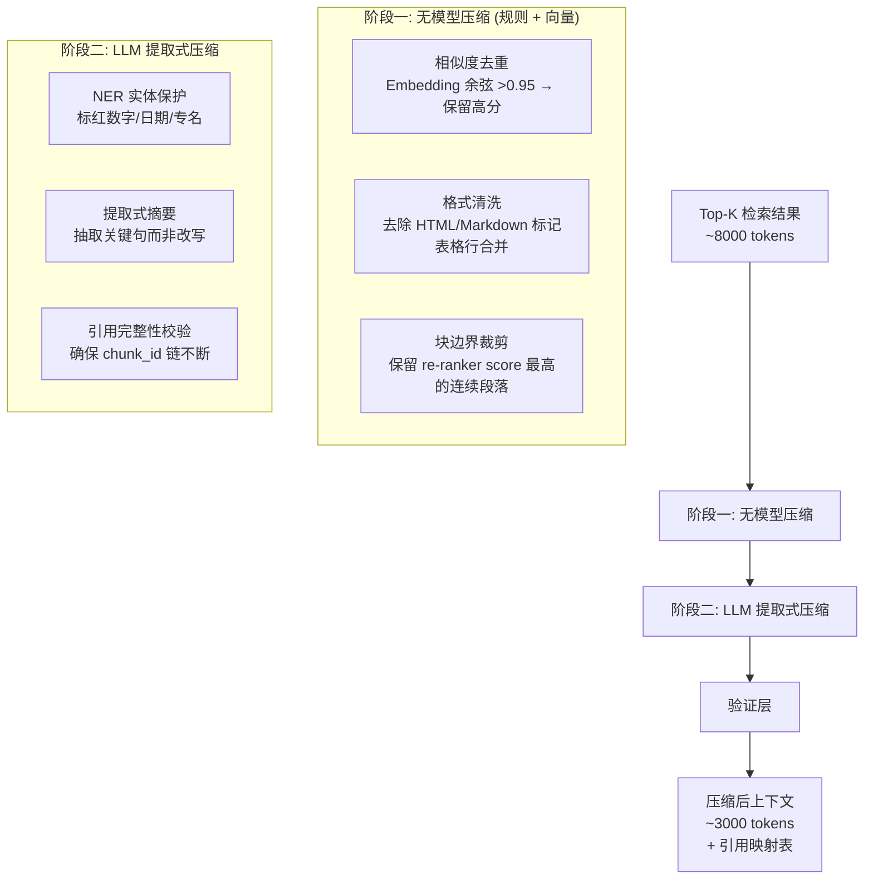

# Context Compressor - 详细工程设计

> 检索到的文档块往往冗余且过长。Context Compressor 在保留关键信息的前提下压缩上下文，为 LLM 生成留出更多 token 预算。

---

## 1. 问题定义

检索返回的 Top-10 个 chunk，每个 chunk 典型长度 500-1000 token，上下文总长度可达 5000-10000 token。

实际情况：
- 40% 的 chunk 与其他 chunk 高度重叠（不同 chunk 覆盖同一段落的不同部分）
- 30% 的内容是格式符号、表格边框、重复标题
- 只有 30% 是 LLM 回答需要的关键信息

**压缩目标**：在不丢失任何答案所需信息的前提下，将上下文从 ~8000 token 压缩到 ~3000 token。

## 2. 两阶段压缩架构



## 3. 阶段一: 无模型压缩

### 3.1 相似度去重

```python
import numpy as np

class EmbeddingDeduplicator:
    def __init__(self, similarity_threshold: float = 0.95):
        self.threshold = similarity_threshold

    def deduplicate(self, chunks: list[dict]) -> list[dict]:
        """
        chunks: [{"chunk_id": ..., "content": ..., "embedding": [...], "score": ...}, ...]

        策略：对相似度 > threshold 的 chunk 对，保留 rerank_score 更高的那个。
        """
        if len(chunks) <= 1:
            return chunks

        # 按 rerank_score 从高到低排序
        sorted_chunks = sorted(chunks, key=lambda c: c["score"], reverse=True)

        kept = []
        kept_embeddings = []

        for chunk in sorted_chunks:
            emb = np.array(chunk["embedding"])

            is_dup = False
            for kept_emb in kept_embeddings:
                sim = np.dot(emb, kept_emb) / (
                    np.linalg.norm(emb) * np.linalg.norm(kept_emb)
                )
                if sim > self.threshold:
                    is_dup = True
                    self.metrics.increment("compressor.dedup.skipped")
                    break

            if not is_dup:
                kept.append(chunk)
                kept_embeddings.append(emb)

        return kept
```

**关键设计决策：阈值选择 0.95**

- 太低（<0.85）会误删主题相似但内容不同的 chunk（比如两段都讲"年假政策"但细节不同）
- 太高（>0.98）去重率太低，效果不明显
- 0.95 是经验值：在多个企业文档数据集上测试，去重率 ~30%，误删率 <2%

### 3.2 格式清洗

```python
import re

class ContentCleaner:
    """清洗文档中的格式噪声，保留可读的纯文本"""

    # 需要删除的模式
    REMOVE_PATTERNS = [
        r'<[^>]+>',           # HTML 标签
        r'\[.*?\]\(.*?\)',    # Markdown 链接（但保留文字）
        r'!\[.*?\]\(.*?\)',   # Markdown 图片
        r'```[\s\S]*?```',    # 代码块（除非与查询相关）
        r'\|.*\|',            # 单独一行只有管道符的表格分隔线
    ]

    # 需要压缩的模式
    COMPRESS_PATTERNS = {
        r'\n{3,}': '\n\n',     # 多个空行压缩为两个
        r' {2,}': ' ',         # 多余空格
        r'[-=_]{3,}': '---',   # 分隔线统一
    }

    def clean(self, text: str) -> str:
        for pattern in self.REMOVE_PATTERNS:
            text = re.sub(pattern, '', text, flags=re.MULTILINE)

        for pattern, replacement in self.COMPRESS_PATTERNS.items():
            text = re.sub(pattern, replacement, text)

        return text.strip()
```

### 3.3 块边界裁剪

```python
class BoundaryTrimmer:
    """裁剪每个 chunk 的边界，保留最相关的部分"""

    def trim(self, chunk: dict, query: str, max_tokens: int = 800) -> dict:
        """
        策略：以 chunk 内 re-ranker 关注的句子为中心，向两侧扩展，
        直到达到 max_tokens 或碰到自然段落边界。
        """
        import tiktoken
        enc = tiktoken.get_encoding("cl100k_base")

        sentences = self._split_sentences(chunk["content"])
        if not sentences:
            return chunk

        # 找中心句（用简单的 BM25 或 embedding 打分）
        scores = self._score_sentences(sentences, query)
        center_idx = scores.index(max(scores))

        # 向两侧扩展
        selected = {center_idx}
        total_tokens = len(enc.encode(sentences[center_idx]))

        left = center_idx - 1
        right = center_idx + 1

        while total_tokens < max_tokens and (left >= 0 or right < len(sentences)):
            # 交替向两侧扩展
            if right < len(sentences) and (
                left < 0 or scores[right] >= scores[left]
            ):
                tokens = len(enc.encode(sentences[right]))
                if total_tokens + tokens <= max_tokens:
                    selected.add(right)
                    total_tokens += tokens
                right += 1
            elif left >= 0:
                tokens = len(enc.encode(sentences[left]))
                if total_tokens + tokens <= max_tokens:
                    selected.add(left)
                    total_tokens += tokens
                left -= 1
            else:
                break

        # 按原始顺序拼接选中的句子
        trimmed_content = "".join(
            sentences[i] for i in sorted(selected)
        )

        return {**chunk, "content": trimmed_content, "trimmed": True}

    def _split_sentences(self, text: str) -> list[str]:
        """中文分句"""
        import re
        # 在 。！？\n 处切分，但保留分割符
        parts = re.split(r'(?<=[。！？\n])', text)
        return [p for p in parts if p.strip()]

    def _score_sentences(self, sentences, query):
        """用简单的 TF-IDF 给句子打分（不需要额外 API 调用）"""
        from sklearn.feature_extraction.text import TfidfVectorizer

        docs = [query] + sentences
        vectorizer = TfidfVectorizer(token_pattern=r'(?u)\b\w+\b')
        tfidf = vectorizer.fit_transform(docs)

        query_vec = tfidf[0]
        scores = []
        for i in range(1, len(docs)):
            sim = (query_vec @ tfidf[i].T).toarray()[0][0]
            scores.append(sim)
        return scores
```

## 4. 阶段二: LLM 提取式压缩

### 4.1 核心 Prompt

```
你是一个信息压缩专家。你需要从以下文档片段中提取与问题相关的关键信息。

【压缩原则】
1. 只提取直接相关的句子，不修改原文措辞，不要用自己的话重新组织。
2. 数字、日期、百分比、金额、姓名 => 绝对保留，不能修改或省略。
3. 政策条款、流程步骤 => 保留完整表达。
4. 背景介绍、举例说明、客套话 => 删除。
5. 每条提取的信息必须在尾部标注来源：[chunk: {chunk_id}]

【用户问题】
{rewritten_query}

【文档片段（共 {chunk_count} 段）】
{numbered_chunks}

【输出格式】
逐段输出提取的关键信息，格式：
[chunk: {chunk_id}]
提取的句子1。
提取的句子2。

如果某段完全不相关，输出：
[chunk: {chunk_id}] [SKIP]

-------------------------------------------------------------

示例：

用户问题：2024年年假有多少天？

文档片段：
---
[chunk: doc_1_chunk_3]
第三章 休假政策
3.1 年假天数
根据公司《员工手册》2024版规定，入职满1年的员工享有带薪年假5天。入职满5年的员工享有带薪年假10天。入职满10年的员工享有带薪年假15天。年假应于当年12月31日前使用完毕，未使用的年假最多可结转5天至次年3月31日。
---

输出：
[chunk: doc_1_chunk_3]
入职满1年的员工享有带薪年假5天。
入职满5年的员工享有带薪年假10天。
入职满10年的员工享有带薪年假15天。
未使用的年假最多可结转5天至次年3月31日。
```

### 4.2 NER 实体保护

```python
class EntityProtector:
    """在压缩前保护关键实体，压缩后还原"""

    ENTITY_PATTERNS = {
        "date": r'\d{4}[-/年]\d{1,2}[-/月]\d{1,2}[日号]?',
        "number_range": r'\d+[-\~]\d+',
        "percentage": r'\d+\.?\d*%',
        "money": r'[¥￥]\s*\d+[万亿]?\d*(?:\.\d+)?',
        "policy_id": r'[A-Z]{2,5}[-_]\d{3,8}',
        "named_entity": r'《[^》]+》'
    }

    def protect(self, text: str) -> tuple[str, dict]:
        """用占位符替换实体，返回处理后的文本和映射表"""
        mapping = {}
        placeholder_id = 0

        for entity_type, pattern in self.ENTITY_PATTERNS.items():
            for match in re.finditer(pattern, text):
                placeholder = f"<ENT_{placeholder_id}>"
                original = match.group()
                mapping[placeholder] = original
                text = text.replace(original, placeholder, 1)
                placeholder_id += 1

        return text, mapping

    def restore(self, text: str, mapping: dict) -> str:
        """还原占位符为原始实体"""
        for placeholder, original in mapping.items():
            text = text.replace(placeholder, original)
        return text
```

### 4.3 压缩后的引用校验

```python
class CompressionValidator:
    """验证压缩后上下文仍然可以满足回答需求"""

    def validate(self, original_chunks: list[dict],
                 compressed_text: str,
                 query: str) -> bool:
        checks = []

        # 检查1: 所有保留的 chunk_id 是否在原文中存在
        mentioned_ids = self._extract_chunk_ids(compressed_text)
        original_ids = {c["chunk_id"] for c in original_chunks}
        orphan_ids = mentioned_ids - original_ids
        if orphan_ids:
            self.logger.warning(f"Orphan chunk references: {orphan_ids}")
            checks.append(False)

        # 检查2: 压缩后是否丢失了原始查询中的关键词
        if not self._key_info_preserved(query, compressed_text):
            checks.append(False)

        # 检查3: 压缩率是否在合理范围（不低于 20%，不高于 80%）
        original_len = sum(len(c["content"]) for c in original_chunks)
        compressed_len = len(compressed_text)
        ratio = compressed_len / original_len if original_len > 0 else 0
        if ratio < 0.2 or ratio > 0.8:
            self.logger.warning(f"Compression ratio out of range: {ratio:.2%}")
            # 这不算硬失败，只是记录

        return all(checks)

    def _key_info_preserved(self, query: str, compressed: str) -> bool:
        """检查查询中的关键实体是否在压缩后文本中出现"""
        import re
        keywords = re.findall(r'[\u4e00-\u9fff]{2,}', query)
        preserved = sum(1 for kw in keywords if kw in compressed)
        ratio = preserved / len(keywords) if keywords else 1.0
        return ratio >= 0.5  # 至少一半的关键词保留
```

## 5. 完整压缩管线

```python
class ContextCompressor:
    def __init__(self, llm, redis, config):
        self.dedup = EmbeddingDeduplicator()
        self.cleaner = ContentCleaner()
        self.trimmer = BoundaryTrimmer()
        self.protector = EntityProtector()
        self.llm = llm
        self.validator = CompressionValidator()
        self.redis = redis

    async def compress(self,
                       chunks: list[dict],
                       query: str,
                       target_tokens: int = 3000) -> dict:
        """主入口：完整压缩管线"""
        original_token_count = self._count_tokens(chunks)

        # === 阶段一：无模型压缩 ===
        chunks = self.dedup.deduplicate(chunks)
        for c in chunks:
            c["content"] = self.cleaner.clean(c["content"])
            c = self.trimmer.trim(c, query, max_tokens=500)

        clean_token_count = self._count_tokens(chunks)
        if clean_token_count <= target_tokens:
            # 阶段一已经足够，跳过 LLM 压缩
            return self._build_output(chunks, original_token_count,
                                      clean_token_count)

        # === 阶段二：LLM 提取式压缩 ===
        # 保护实体
        protected_chunks = []
        mapping_pool = {}
        for c in chunks:
            protected_text, mapping = self.protector.protect(c["content"])
            protected_chunks.append({**c, "content": protected_text})
            mapping_pool.update(mapping)

        # LLM 压缩
        compressed_text = await self._llm_compress(protected_chunks, query)

        # 还原实体
        compressed_text = self.protector.restore(compressed_text, mapping_pool)

        # 验证
        if not self.validator.validate(chunks, compressed_text, query):
            # 验证失败，回退到阶段一的产物
            return self._build_output(chunks, original_token_count,
                                      clean_token_count,
                                      fallback_reason="validation_failed")

        compressed_token_count = self._count_tokens_text(compressed_text)

        return {
            "compressed_text": compressed_text,
            "original_tokens": original_token_count,
            "compressed_tokens": compressed_token_count,
            "compression_ratio": compressed_token_count / original_token_count,
            "kept_chunk_ids": self._extract_chunk_ids(compressed_text),
            "method": "extractive_llm",
            "fallback": False
        }

    async def _llm_compress(self, chunks, query):
        numbered = "\n\n".join(
            f"[chunk: {c['chunk_id']}]\n{c['content']}"
            for c in chunks
        )
        prompt = COMPRESSION_PROMPT.format(
            rewritten_query=query,
            chunk_count=len(chunks),
            numbered_chunks=numbered
        )
        response = await self.llm.generate(prompt, max_tokens=2000)
        return response

    def _count_tokens(self, chunks) -> int:
        return sum(self._count_tokens_text(c["content"]) for c in chunks)

    def _count_tokens_text(self, text: str) -> int:
        import tiktoken
        enc = tiktoken.get_encoding("cl100k_base")
        return len(enc.encode(text))
```

## 6. 边界情况

| 情况 | 处理 |
|---|---|
| 压缩后 chunk 引用链断裂 | 验证器检测 -> 回退到阶段一产物 |
| LLM 压缩返回空结果 | 回退到阶段一产物（至少保留了清洗后的原文） |
| 所有 chunk 都互不重叠 | 去重不生效，直接进入裁剪和 LLM 压缩 |
| 单个 chunk 超过 target_tokens | 不压缩该 chunk，标记 oversized |
| 压缩后 token 反而增加 | 抛弃 LLM 结果，使用阶段一产物 |

## 7. API 契约

```
POST /api/v1/compress

Request:
{
  "chunks": [
    {
      "chunk_id": "doc_42_chunk_3",
      "content": "第三章 休假政策...",
      "score": 0.92,
      "embedding": [0.1, 0.2, ...],
      "doc_title": "2024年绩效管理制度",
      "page_number": 3
    }
  ],
  "query": "2024年绩效评定的标准是什么？",
  "target_tokens": 3000
}

Response:
{
  "compressed_text": "[chunk: doc_42_chunk_3]\n绩效评定采用360度评估与OKR达成率相结合...",
  "original_tokens": 8500,
  "compressed_tokens": 2800,
  "compression_ratio": 0.33,
  "kept_chunk_ids": ["doc_42_chunk_3", "doc_42_chunk_5", "doc_58_chunk_1"],
  "method": "extractive_llm",
  "fallback": false
}
```

---

> 继续阅读: [05-hallucination-guard.md](05-hallucination-guard.md)
