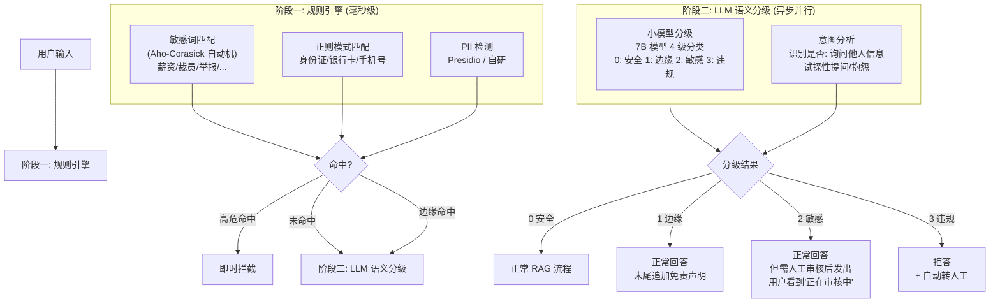

# Safety Enforcer - 详细工程设计

> 两阶段安全检测：毫秒级规则引擎 + 异步 LLM 语义分级，确保敏感问题（薪资、裁员等）在进入 RAG 管线前被拦截或分级处理。

---

## 1. 设计原则

企业客服系统面临的安全挑战：

| 风险类型 | 示例 | 后果 |
|---|---|---|
| 薪资信息泄露 | "李四的工资是多少？" | 合规风险、员工投诉 |
| 敏感人事话题 | "公司下半年要裁员吗？" | 谣言传播、恐慌 |
| 法律合规 | "我要举报某部门违规操作" | 法律风险 |
| PII 泄露 | "我的身份证号是..." | 隐私法规违规 |

**核心原则：安全检测必须发生在检索之前，因为检索本身就会暴露知识库内容。**

## 2. 两阶段架构



## 3. 阶段一: 规则引擎

### 3.1 敏感词库结构

```python
# 词库数据模型
SENSITIVE_PATTERNS = {
    # 高危词（命中即拦截，不进入 LLM）
    "critical": {
        "keywords": [
            "裁员", "优化人员", "降薪", "减员",
            "举报违规", "内部调查", "诉讼",
        ],
        "regex": [
            r'(?:(?:工资|薪资|薪酬|年薪|月薪|奖金|股权|期权)\s*[是是多少有几].*)',
            r'(?:某人|某员工|谁|哪个部门).*(?:违规|违法|受贿)',
            r'\d{17}[\dXx]',   # 身份证
            r'1[3-9]\d{9}',     # 手机号
        ]
    },
    
    # 边缘敏感词（触发 LLM 分级）
    "edge": {
        "keywords": [
            "绩效评定", "晋升", "组织架构调整",
            "加班费", "赔偿", "离职",
        ],
    },
    
    # 仅需免责声明的话题
    "disclaimer": {
        "keywords": [
            "投资建议", "税务规划", "法律咨询",
        ],
    }
}
```

### 3.2 Aho-Corasick 自动机实现

```python
import ahocorasick

class SensitiveWordMatcher:
    def __init__(self):
        self.automaton = ahocorasick.Automaton()
        self._build()

    def _build(self):
        """构建 AC 自动机，支持一次扫描匹配所有敏感词"""
        idx = 0
        for level, config in SENSITIVE_PATTERNS.items():
            for keyword in config.get("keywords", []):
                self.automaton.add_word(keyword, (idx, level, keyword))
                idx += 1

        self.automaton.make_automaton()

    def match(self, text: str) -> dict:
        """单次扫描返回所有命中"""
        hits = {"critical": [], "edge": [], "disclaimer": []}
        for end_idx, (_, level, keyword) in self.automaton.iter(text):
            hits[level].append({
                "keyword": keyword,
                "position": end_idx - len(keyword),
                "level": level
            })
        return hits
```

### 3.3 PII 检测

```python
class PIIDetector:
    """检测个人身份信息"""

    PII_PATTERNS = {
        "id_card": r'\b\d{17}[\dXx]\b',
        "phone": r'\b1[3-9]\d{9}\b',
        "email": r'\b[\w.-]+@[\w.-]+\.\w+\b',
        "bank_card": r'\b\d{16,19}\b',
    }

    def detect(self, text: str) -> list[dict]:
        findings = []
        for pii_type, pattern in self.PII_PATTERNS.items():
            import re
            for match in re.finditer(pattern, text):
                findings.append({
                    "type": pii_type,
                    "value": match.group(),
                    "position": match.start(),
                    "action": "mask"  # 建议动作：掩码处理
                })
        return findings

    def mask(self, text: str) -> str:
        """对检测到的 PII 进行掩码处理"""
        for finding in self.detect(text):
            value = finding["value"]
            if finding["type"] == "phone":
                masked = value[:3] + "****" + value[-4:]
            elif finding["type"] == "id_card":
                masked = value[:3] + "*********" + value[-4:]
            elif finding["type"] == "email":
                parts = value.split("@")
                masked = parts[0][:2] + "***@" + parts[1]
            else:
                masked = "***"
            text = text.replace(value, masked)
        return text
```

## 4. 阶段二: LLM 语义分级

### 4.1 分级 Prompt

```
你是一个敏感话题检测模型。请对以下用户问题进行分类。

【分类标准】

0 - 完全安全：
  正常的知识咨询，不涉及任何敏感话题。
  例："年假有几天？" "报销流程是什么？"

1 - 边缘话题：
  讨论公司政策的正当提问，但可能在特定语境下敏感。
  例："绩效不好会有什么影响？" "公司一般什么时候调薪？"

2 - 敏感话题：
  涉及个人薪资查询、人事变动猜测、组织架构敏感信息。
  例："我为什么没涨薪？" "部门是不是要合并了？"

3 - 明显违规：
  查询他人隐私、涉及保密信息、恶意试探系统。
  例："张三的工资是多少？" "公司法务漏洞在哪里？"

【用户身份】
部门: {dept}
职级: {level}

【当前问题】
{query}

【对话历史摘要】
{history_summary}

【输出格式】
{{
  "level": 0,
  "reasoning": "简短理由",
  "confidence": 0.95
}}
```

### 4.2 分级器实现

```python
class LLMSafetyClassifier:
    def __init__(self, llm, timeout_ms: int = 1500):
        self.llm = llm
        self.timeout_ms = timeout_ms

    async def classify(self, query: str,
                       user_context: dict,
                       history_summary: str) -> dict:
        prompt = SAFETY_CLASSIFY_PROMPT.format(
            dept=user_context.get("department", "未知"),
            level=user_context.get("level", "未知"),
            query=query,
            history_summary=history_summary
        )

        try:
            response = await asyncio.wait_for(
                self.llm.generate(prompt, max_tokens=100),
                timeout=self.timeout_ms / 1000
            )
            result = json.loads(response)
        except (asyncio.TimeoutError, json.JSONDecodeError):
            # 超时或解析失败，保守降级为 2 级（敏感）
            return {"level": 2, "reasoning": "分类器失败，保守处理",
                    "confidence": 0.5, "fallback": True}

        return result
```

## 5. 完整安全检测管线

```python
class SafetyEnforcer:
    def __init__(self, llm, config):
        self.word_matcher = SensitiveWordMatcher()
        self.pii_detector = PIIDetector()
        self.classifier = LLMSafetyClassifier(llm)
        self.config = config

    async def enforce(self, query: str,
                      user_context: dict,
                      history_summary: str = "") -> dict:
        # === 阶段一：规则引擎 ===
        word_hits = self.word_matcher.match(query)
        pii_findings = self.pii_detector.detect(query)

        # 高危命中 → 立即拦截
        if word_hits.get("critical"):
            return {
                "action": "block",
                "reason": "critical_keyword_hit",
                "details": word_hits["critical"],
                "message": "抱歉，该问题涉及敏感信息，已转接人工客服处理。",
                "escalate": True
            }

        # PII 检测到信息 → 掩码后放行（但记录日志）
        if pii_findings:
            masked_query = self.pii_detector.mask(query)
            self.audit_log.warning("pii_detected_and_masked",
                                   original=query, masked=masked_query)
            query = masked_query

        # === 阶段二：LLM 分级（异步，不阻塞） ===
        # 如果没有任何边缘命中，可以快速通过
        if not word_hits.get("edge") and not word_hits.get("disclaimer"):
            classification = await self.classifier.classify(
                query, user_context, history_summary
            )
        else:
            # 有边缘命中，必须等待分级结果
            classification = await self.classifier.classify(
                query, user_context, history_summary
            )

        # === 根据分级结果路由 ===
        level = classification.get("level", 2)  # 默认保守

        if level == 0:
            return {"action": "pass", "message": ""}
        elif level == 1:
            return {
                "action": "append_disclaimer",
                "message": "",
                "disclaimer": "以上回答仅供参考，具体情况请咨询HR部门。"
            }
        elif level == 2:
            return {
                "action": "queue_for_review",
                "message": "您的问题正在审核中，预计30分钟内回复。",
                "review_needed": True
            }
        else:  # level == 3
            return {
                "action": "block",
                "reason": "llm_flagged_level3",
                "message": "抱歉，该问题超出我能回答的范围，已为您转接人工客服。",
                "escalate": True
            }
```

## 6. 敏感词库管理

```python
# 词库更新接口
class SensitiveWordManager:
    def __init__(self, db, redis):
        self.db = db
        self.redis = redis
        self.matcher = SensitiveWordMatcher()

    async def reload(self):
        """从数据库重新加载词库并重建 AC 自动机"""
        patterns = await self.db.fetch_all(
            "SELECT keyword, level FROM sensitive_words WHERE active = true"
        )
        # 更新内存中的词库
        SENSITIVE_PATTERNS.clear()
        for row in patterns:
            level = row["level"]
            if level not in SENSITIVE_PATTERNS:
                SENSITIVE_PATTERNS[level] = {"keywords": [], "regex": []}
            SENSITIVE_PATTERNS[level]["keywords"].append(row["keyword"])

        # 重建 AC 自动机
        self.matcher.rebuild()
        self.redis.set("safety:wordlist_version",
                       str(int(time.time())))

    async def add_word(self, keyword: str, level: str, added_by: str):
        """运营人员添加敏感词"""
        await self.db.execute(
            "INSERT INTO sensitive_words (keyword, level, added_by) "
            "VALUES ($1, $2, $3) ON CONFLICT DO NOTHING",
            keyword, level, added_by
        )
        await self.reload()

    async def remove_word(self, keyword: str):
        """运营人员移除敏感词"""
        await self.db.execute(
            "UPDATE sensitive_words SET active = false WHERE keyword = $1",
            keyword
        )
        await self.reload()
```

## 7. 审计日志

```python
class SafetyAuditLogger:
    """记录所有安全相关事件的审计日志"""

    async def log(self, event_type: str, query: str, user_id: str,
                  decision: dict, **kwargs):
        record = {
            "timestamp": datetime.utcnow().isoformat(),
            "event_type": event_type,
            "user_id": user_id,
            "query": query[:200],  # 截断长查询
            "decision": decision.get("action"),
            "level": decision.get("level"),
            "reason": decision.get("reason"),
            "metadata": kwargs
        }

        # 写入 PostgreSQL 审计表
        await self.db.execute(
            """INSERT INTO safety_audit_log
               (timestamp, event_type, user_id, query, decision, level, reason, metadata)
               VALUES ($1, $2, $3, $4, $5, $6, $7, $8)""",
            *record.values()
        )

        # 严重事件也写入告警系统
        if decision.get("action") in ("block",):
            await self.alert.send(
                title=f"安全拦截: {event_type}",
                body=f"用户 {user_id} 提问: {query[:100]}...",
                severity="warning"
            )
```

## 8. 性能指标

| 指标 | 目标 | 备注 |
|---|---|---|
| 规则引擎延迟 | < 5ms | AC 自动机单次扫描 |
| LLM 分级延迟 (P99) | < 1.5s | 7B 模型 |
| 误拦率 | < 0.5% | 应该放行但被拦截 |
| 漏拦率 | < 1% | 应该拦截但放行 |
| 词库更新生效延迟 | < 30s | 从管理后台到内存生效 |

## 9. API 契约

```
POST /api/v1/safety/check

Request:
{
  "query": "李四的工资是多少？",
  "user_id": "emp_12345",
  "user_context": {
    "department": "研发部",
    "level": "P6"
  },
  "session_id": "sess_abc123",
  "history_summary": "用户正在咨询休假政策，上一轮问过年假天数"
}

Response:
{
  "action": "block",
  "reason": "critical_keyword_hit",
  "level": null,
  "message": "抱歉，该问题涉及敏感信息，已转接人工客服处理。",
  "escalate": true,
  "details": {
    "hit_keywords": ["工资"],
    "pii_detected": false
  }
}
```

---

> 继续阅读: [07-escalation-handler.md](07-escalation-handler.md)
