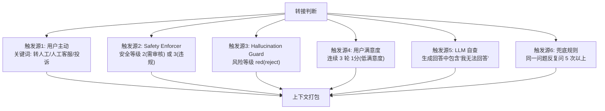

# Escalation Handler - 详细工程设计

> 人工转接决策、上下文打包、智能路由到对应客服队列。

---

## 1. 转接触发条件



**设计理由**：不是等用户喊"转人工"才动作，系统应当**主动感知**——当 Hallucination Guard 拒绝回答、安全层标记敏感、或用户连续不满意，系统自动触发转接。

## 2. 上下文打包

### 2.1 转接包数据结构

```python
from dataclasses import dataclass, field
from datetime import datetime
from typing import Optional

@dataclass
class EscalationPackage:
    """转接时的完整上下文包"""
    # 基础信息
    escalation_id: str
    trigger_reason: str  # user_request | safety_block | hallucination_reject | ...
    priority: int  # 1=紧急, 2=高, 3=普通

    # 用户信息
    user_id: str
    user_name: str
    user_department: str
    user_level: str
    user_contact: str  # 企业微信/邮箱

    # 对话信息
    session_id: str
    conversation_history: list[dict]  # 完整对话历史
    current_query: str
    context_summary: str  # LLM 生成的对话摘要

    # 系统诊断信息
    safety_verdict: Optional[dict]  # 安全检测结果
    hallucination_verdict: Optional[dict]  # 幻觉检测结果

    # 检索上下文
    retrieved_chunks: list[dict]  # 系统检索到的相关文档块
    suggested_answer: Optional[str]  # AI 原本准备给出的回答（被拦截的）

    # 路由信息
    suggested_queue: str  # HR / IT / 财务 / 法务
    topic_tags: list[str]  # ["薪资", "年假", "绩效"]

    # 元数据
    created_at: str
    ttl_minutes: int = 30  # 30分钟未处理则过期
```

### 2.2 打包流程

```python
class ContextPackager:
    def __init__(self, llm, redis, db):
        self.llm = llm
        self.redis = redis
        self.db = db

    async def build_package(self,
                            session_id: str,
                            trigger_reason: str,
                            diagnostics: dict = None) -> EscalationPackage:
        # 1. 从 Redis 加载完整对话历史
        history = await self._load_history(session_id)
        current_query = history[-1]["user_query"] if history else ""

        # 2. 从数据库加载用户信息
        user_info = await self.db.fetch_one(
            "SELECT id, name, department, level, wechat_id FROM users "
            "WHERE id = $1",
            history[0].get("user_id") if history else None
        )

        # 3. 生成对话摘要
        summary = await self._generate_summary(history)

        # 4. 话题分类
        tags = await self._classify_topic(current_query, history)

        # 5. 确定路由队列
        queue = self._route_queue(tags, trigger_reason, diagnostics)

        # 6. 组装包
        package = EscalationPackage(
            escalation_id=self._generate_id(),
            trigger_reason=trigger_reason,
            priority=self._compute_priority(trigger_reason, diagnostics),
            user_id=user_info["id"],
            user_name=user_info["name"],
            user_department=user_info["department"],
            user_level=user_info["level"],
            user_contact=user_info["wechat_id"],
            session_id=session_id,
            conversation_history=history,
            current_query=current_query,
            context_summary=summary,
            safety_verdict=diagnostics.get("safety") if diagnostics else None,
            hallucination_verdict=diagnostics.get("hallucination") if diagnostics else None,
            retrieved_chunks=diagnostics.get("chunks", []) if diagnostics else [],
            suggested_answer=diagnostics.get("blocked_answer"),
            suggested_queue=queue,
            topic_tags=tags,
            created_at=datetime.utcnow().isoformat()
        )

        # 7. 持久化到 Redis（TTL 30分钟），防止客服离线导致丢失
        await self.redis.setex(
            f"escalation:{package.escalation_id}",
            1800,  # 30 min TTL
            json.dumps(package.__dict__)
        )

        return package

    async def _generate_summary(self, history: list[dict]) -> str:
        if not history:
            return "无历史对话"

        prompt = f"""
请用一段话总结以下客服对话的核心内容，帮助接手的人工客服快速理解上下文：

{self._format_history(history)}

摘要应包含：
1. 用户身份和部门
2. 用户在咨询什么
3. 系统回答了什么、哪里有困难
4. 用户是否表现出不满
"""
        return await self.llm.generate(prompt, max_tokens=150)

    async def _classify_topic(self, query: str,
                              history: list[dict]) -> list[str]:
        """多标签话题分类"""
        prompt = f"""
对以下用户问题进行话题分类，可多标签：

标签体系：
- 薪资福利、休假政策、绩效考核、入职离职
- IT支持、报销流程、培训发展、组织架构
- 法律合规、其他

问题：{query}

输出 JSON: {{"tags": ["标签1", "标签2"]}}
"""
        response = await self.llm.generate(prompt, max_tokens=100)
        try:
            return json.loads(response).get("tags", ["其他"])
        except:
            return ["其他"]

    def _route_queue(self, tags: list[str], trigger: str,
                     diagnostics: dict) -> str:
        """根据话题和触发原因路由到对应客服队列"""
        # 安全事件 → 优先 HR
        if trigger == "safety_block":
            return "hr-senior"

        # 按话题路由
        tag_to_queue = {
            "薪资福利": "hr-compensation",
            "休假政策": "hr-general",
            "绩效考核": "hr-performance",
            "入职离职": "hr-onboarding",
            "IT支持": "it-helpdesk",
            "报销流程": "finance-expense",
            "法律合规": "legal-compliance",
        }

        for tag in tags:
            if tag in tag_to_queue:
                return tag_to_queue[tag]

        return "general-support"

    def _compute_priority(self, trigger: str, diagnostics: dict) -> int:
        if trigger == "safety_block":
            return 1  # 紧急
        if trigger == "user_request":
            return 2  # 高
        return 3  # 普通

    def _format_history(self, history: list) -> str:
        lines = []
        for i, turn in enumerate(history, 1):
            lines.append(f"[第{i}轮]")
            lines.append(f"  用户: {turn['user_query']}")
            if turn.get("assistant_answer"):
                lines.append(f"  助手: {turn['assistant_answer'][:200]}...")
            if turn.get("user_feedback"):
                lines.append(f"  用户反馈: {turn['user_feedback']}")
        return "\n".join(lines)

    def _generate_id(self) -> str:
        return f"ESC-{datetime.utcnow().strftime('%Y%m%d%H%M%S')}-{uuid.uuid4().hex[:6]}"
```

## 3. 客服端展示

转接包在客服端应该呈现为一张结构化的卡片：

```
+--------------------------------------------------------------------------+
| [紧急] 转接请求 #ESC-20260613143000-a1b2c3         30分钟内有效        |
+--------------------------------------------------------------------------+
|                                                                          |
| 触发原因: 用户主动要求人工客服                                           |
|                                                                          |
| 用户信息                                                                |
|  姓名: 张三 | 部门: 研发部 | 职级: P7 | 企业微信: @zhangsan            |
|                                                                          |
| 对话摘要                                                                |
|  张三是研发部P7员工，正在咨询2024年绩效评定标准。系统已经提供了          |
|  360评估和OKR相关规定，但用户对"自评占比"的计算方式仍有疑问。            |
|  上一轮系统回答后用户点了"踩"。                                          |
|                                                                          |
| 完整对话 [展开]                                                         |
|                                                                          |
| AI 原本准备回答的内容 (系统拦截)                                         |
|  绩效评定的自评部分占总分的30%，其中... (可能不准确)                     |
|                                                                          |
| 系统检索到的相关文档块                                                   |
|  [doc_42] 2024年绩效管理制度 - 第3页 (相关性 0.92)                      |
|  [doc_58] 绩效评定FAQ - 第1页 (相关性 0.88)                             |
|                                                                          |
| 话题标签: 绩效考核, 薪资福利                                             |
| 建议队列: HR-Performance                                                 |
+--------------------------------------------------------------------------+
| [接单] [转接给其他人] [标记已读]                                          |
+--------------------------------------------------------------------------+
```

## 4. 客服端 API

```
GET /api/v1/escalation/queue?queue=hr-performance

Response:
{
  "queue_name": "HR-Performance",
  "pending_count": 3,
  "items": [
    {
      "escalation_id": "ESC-20260613143000-a1b2c3",
      "priority": 2,
      "created_at": "2026-06-13T14:30:00Z",
      "user_name": "张三",
      "user_department": "研发部",
      "context_summary": "张三是研发部P7员工...",
      "topic_tags": ["绩效考核", "薪资福利"],
      "ttl_remaining_seconds": 1500
    }
  ]
}

POST /api/v1/escalation/{escalation_id}/claim
# 客服接单

POST /api/v1/escalation/{escalation_id}/transfer
{
  "target_agent_id": "agent_456",
  "reason": "需要法务介入"
}
# 转接给其他客服

POST /api/v1/escalation/{escalation_id}/resolve
{
  "resolution": "已向用户解释自评占比计算方式为...",
  "resolved_by": "agent_123"
}
# 标记已解决
```

## 5. 重复转接保护

```python
class EscalationDedup:
    """防止同一问题被重复转接"""

    def __init__(self, redis):
        self.redis = redis

    async def should_escalate(self, session_id: str,
                              trigger_reason: str) -> bool:
        """检查是否应该触发转接（防止重复）"""
        key = f"escalation:dedup:{session_id}"

        # 获取最近一次转接
        last = await self.redis.get(key)
        if last:
            last_data = json.loads(last)
            elapsed = time.time() - last_data["timestamp"]

            # 同一原因 5 分钟内的重复转接，忽略
            if (last_data["trigger"] == trigger_reason and
                    elapsed < 300):
                return False

        # 记录本次转接
        await self.redis.setex(key, 3600, json.dumps({
            "trigger": trigger_reason,
            "timestamp": time.time(),
            "escalation_id": "..."
        }))

        return True
```

## 6. 超时与兜底

| 情况 | 处理 |
|---|---|
| 30 分钟内无人接单 | 自动升级优先级到 1，通知队列主管 |
| 60 分钟内无人接单 | 发送告警到值班经理 |
| 用户关闭浏览器 | 转接包保留，客服可通过工单系统继续处理 |
| 同一用户反复触发转接 | 合并到同一个工单，不重复创建 |

## 7. API 契约

```
POST /api/v1/escalate

Request:
{
  "session_id": "sess_abc123",
  "trigger_reason": "hallucination_reject",
  "diagnostics": {
    "safety": {"action": "pass"},
    "hallucination": {"verdict": "reject", "fused_score": 0.42},
    "chunks": [{...}],
    "blocked_answer": "绩效评定自评部分占比30%..."
  }
}

Response:
{
  "escalation_id": "ESC-20260613143000-a1b2c3",
  "status": "queued",
  "message": "已为您转接人工客服，请稍候...",
  "estimated_wait_seconds": 120,
  "queue_position": 3
}
```

---

> 继续阅读: [08-evaluation.md](08-evaluation.md)
