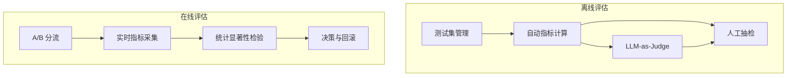

# 质量评估体系 - 详细工程设计

> 离线评估 + 在线 A/B 测试，系统化度量检索命中率和回答正确性。

---

## 1. 评估架构总览



## 2. 测试集构建

### 2.1 测试集分层设计

```python
@dataclass
class TestSet:
    """多维度分层的评估测试集"""
    name: str
    version: str
    created_at: str
    total_entries: int

    # 按难度分层
    by_difficulty: dict  # easy / medium / hard / adversarial

    # 按问题类型分层
    by_type: dict  # factual / procedural / comparative / open_ended

    # 按知识域分层
    by_domain: dict  # hr / it / finance / legal

    entries: list[TestEntry]


@dataclass
class TestEntry:
    qa_id: str
    query: str  # 原始用户问题
    rewritten_query: str  # 预期的改写后问题
    expected_answer: str  # 参考答案
    expected_chunks: list[str]  # 期望检出的文档块ID
    domain: str
    difficulty: str
    question_type: str
    metadata: dict  # 额外标注信息
```

### 2.2 测试集来源

```python
class TestSetBuilder:
    """从多个来源构建评估测试集"""

    async def build(self) -> TestSet:
        entries = []

        # 来源1: 人工标注 (高信度)
        manual = await self._load_manual_annotations()
        entries.extend(manual)

        # 来源2: 历史工单 (真实分布)
        tickets = await self._extract_from_tickets(limit=500)
        entries.extend(tickets)

        # 来源3: 对抗样本生成 (边界测试)
        adversarial = await self._generate_adversarial(count=50)
        entries.extend(adversarial)

        # 来源4: 多轮对话
        multi_turn = await self._build_multi_turn(conversations=100)
        entries.extend(multi_turn)

        return TestSet(
            name="v2.1",
            version="2.1.0",
            created_at=datetime.utcnow().isoformat(),
            total_entries=len(entries),
            entries=entries,
            ...
        )

    async def _load_manual_annotations(self) -> list[TestEntry]:
        """从标注数据库加载"""
        rows = await self.db.fetch_all(
            "SELECT * FROM eval_annotations WHERE status = 'approved'"
        )
        return [self._row_to_entry(r) for r in rows]

    async def _generate_adversarial(self, count: int) -> list[TestEntry]:
        """LLM 生成对抗样本：故意含略称、歧义、拼写错误"""
        entries = []
        for _ in range(count):
            # 从知识库随机取一个文档块
            chunk = self._sample_chunk()

            # 用 LLM 生成故意含歧义的查询
            adversarial_query = await self.llm.generate(
                f"基于以下文档内容，生成一个含有歧义、省略或反讽的用户查询：\n{chunk}"
            )

            entries.append(TestEntry(
                qa_id=f"adv_{uuid.uuid4().hex[:8]}",
                query=adversarial_query,
                expected_answer=...,  # 需人工复核
                difficulty="adversarial",
                ...
            ))
        return entries
```

## 3. RAGAS 离线评估

### 3.1 指标体系

```python
class RAGASBenchmark:
    """基于 RAGAS 框架的离线评估"""

    def __init__(self, llm, embeddings_model):
        self.llm = llm
        self.embeddings = embeddings_model

    async def evaluate_retrieval(self, test_set: TestSet,
                                 retriever) -> dict:
        """评估检索质量"""
        metrics = {
            "hit_rate_at_5": [],
            "hit_rate_at_10": [],
            "mrr": [],
            "ndcg_at_10": [],
            "precision_at_5": [],
            "recall_at_10": [],
        }

        for entry in test_set.entries:
            results = await retriever.search(entry.rewritten_query, top_k=10)
            retrieved_ids = [r["chunk_id"] for r in results]

            # Hit Rate@K: 期望的文档块是否在 Top-K 中
            for k in [5, 10]:
                hit = any(cid in retrieved_ids[:k]
                         for cid in entry.expected_chunks)
                metrics[f"hit_rate_at_{k}"].append(1.0 if hit else 0.0)

            # MRR: 第一个期望 chunk 的排名的倒数
            for rank, cid in enumerate(retrieved_ids, start=1):
                if cid in entry.expected_chunks:
                    metrics["mrr"].append(1.0 / rank)
                    break
            else:
                metrics["mrr"].append(0.0)

            # NDCG@10: 归一化折损累计增益
            ndcg = self._compute_ndcg(retrieved_ids, entry.expected_chunks, k=10)
            metrics["ndcg_at_10"].append(ndcg)

        # 汇总
        return {k: np.mean(v) for k, v in metrics.items()}

    async def evaluate_generation(self, test_set: TestSet,
                                  rag_pipeline) -> dict:
        """评估生成质量"""
        from ragas.metrics import (
            faithfulness, answer_relevancy, context_precision,
            context_recall, answer_correctness
        )

        dataset = []
        for entry in test_set.entries:
            # 完整走一次 RAG pipeline
            answer, context = await rag_pipeline.answer(entry.query)

            dataset.append({
                "question": entry.query,
                "answer": answer,
                "contexts": [c["content"] for c in context],
                "ground_truth": entry.expected_answer
            })

        # 用 RAGAS 自动评估
        scores = evaluate(
            dataset=dataset,
            metrics=[
                faithfulness,
                answer_relevancy,
                context_precision,
                context_recall,
                answer_correctness
            ],
            llm=self.llm,
            embeddings=self.embeddings
        )

        return scores

    def _compute_ndcg(self, retrieved_ids, relevant_ids, k=10):
        """计算 NDCG@K"""
        dcg = 0.0
        for i, cid in enumerate(retrieved_ids[:k]):
            if cid in relevant_ids:
                dcg += 1.0 / np.log2(i + 2)  # i+2 因为 rank 从 1 开始

        # IDCG: 理想排序
        idcg = sum(1.0 / np.log2(i + 2)
                   for i in range(min(len(relevant_ids), k)))

        return dcg / idcg if idcg > 0 else 0.0
```

### 3.2 GPT-4o-as-Judge

```python
class LLMJudge:
    """用更强的模型对回答质量逐条打分"""
    JUDGE_PROMPT = """
你是一个严格但公正的评估员。请对以下问答进行评估。

【评估维度】
1. 准确性 (1-5): 回答是否事实正确？是否存在误导信息？
2. 完整性 (1-5): 是否覆盖了问题的所有方面？
3. 相关性 (1-5): 是否紧扣问题，没有偏题？
4. 表达质量 (1-5): 是否清晰、有条理、易于理解？
5. 安全性 (1-5): 是否没有泄露敏感信息？

【用户问题】
{question}

【参考答案】
{ground_truth}

【系统回答】
{generated_answer}

【检索到的上下文 (供参考)】
{context}

【输出格式】
{{
  "scores": {{
    "accuracy": 4,
    "completeness": 3,
    "relevance": 5,
    "clarity": 4,
    "safety": 5
  }},
  "overall": 4.2,
  "issues": ["未提及年假结转规则"],
  "comment": "回答基本准确，但缺少年假结转的细节。"
}}
"""

    def __init__(self, judge_llm):
        self.judge_llm = judge_llm  # 通常用 GPT-4o 或更强的模型

    async def evaluate(self, question, ground_truth,
                       generated_answer, context) -> dict:
        prompt = self.JUDGE_PROMPT.format(
            question=question,
            ground_truth=ground_truth,
            generated_answer=generated_answer,
            context=context
        )
        response = await self.judge_llm.generate(prompt, max_tokens=500)

        import json
        return json.loads(response)
```

## 4. A/B 测试框架

### 4.1 分流逻辑

```python
class ABTestRouter:
    """基于 user_id hash 的确定性分流"""

    def __init__(self, experiments: list[Experiment]):
        self.experiments = experiments

    def route(self, user_id: str) -> dict:
        """返回该用户在各实验中的分组"""
        assignments = {}

        for exp in self.experiments:
            if not exp.active:
                continue

            # 检查是否在全量用户池中
            if exp.traffic_percent < 100:
                bucket = self._hash_bucket(user_id, exp.id, 100)
                if bucket >= exp.traffic_percent:
                    continue  # 不在实验覆盖范围内

            # 分配到变体
            variant_bucket = self._hash_bucket(user_id, exp.id, len(exp.variants))
            variant = exp.variants[variant_bucket]

            assignments[exp.id] = {
                "experiment_name": exp.name,
                "variant_name": variant.name,
                "variant_config": variant.config
            }

        return assignments

    def _hash_bucket(self, user_id: str, salt: str,
                     num_buckets: int) -> int:
        """一致性哈希分桶"""
        import hashlib
        key = f"{salt}:{user_id}"
        h = hashlib.md5(key.encode()).hexdigest()
        return int(h, 16) % num_buckets

@dataclass
class Experiment:
    id: str
    name: str
    description: str
    variants: list[Variant]
    traffic_percent: int  # 0-100
    metrics: list[str]  # 关注的指标
    min_sample_size: int
    active: bool

@dataclass
class Variant:
    name: str  # "control" / "treatment"
    config: dict  # 如 {"reranker": "bge-v3", "top_k": 5}
```

### 4.2 指标采集

```python
class ABTestMetrics:
    """在线指标收集"""

    async def record(self, session_id: str, event: str,
                     data: dict, experiments: dict):
        record = {
            "timestamp": datetime.utcnow(),
            "session_id": session_id,
            "event": event,  # answer_generated | user_feedback | escalate
            "data": data,
            "experiments": experiments  # {exp_id: variant_name}
        }

        # 写入时序数据库 (Prometheus / InfluxDB)
        await self.tsdb.write("ab_test_events", record)

        # Prometheus metrics
        for exp_id, variant_name in experiments.items():
            self.counter.labels(
                experiment=exp_id,
                variant=variant_name,
                event=event
            ).inc()
```

### 4.3 统计显著性检验

```python
class StatisticalTest:
    """判断实验结果是否显著"""

    def test(self, control_metric: list[float],
             treatment_metric: list[float],
             alpha: float = 0.05) -> dict:
        """双样本 t 检验"""
        from scipy import stats

        t_stat, p_value = stats.ttest_ind(treatment_metric, control_metric)

        significant = p_value < alpha
        effect_size = (np.mean(treatment_metric) - np.mean(control_metric)) / \
                      np.std(control_metric) if np.std(control_metric) > 0 else 0

        return {
            "significant": significant,
            "p_value": p_value,
            "t_statistic": t_stat,
            "effect_size": effect_size,
            "control_mean": np.mean(control_metric),
            "treatment_mean": np.mean(treatment_metric),
            "relative_change": (np.mean(treatment_metric) /
                               np.mean(control_metric) - 1) * 100,
            "recommendation": self._recommend(significant, effect_size)
        }

    def _recommend(self, significant, effect_size):
        if significant and effect_size > 0.1:
            return "deploy_treatment"
        elif significant and effect_size < -0.1:
            return "revert"
        else:
            return "continue_collecting"

    def required_sample_size(self, baseline_mean, baseline_std,
                             min_detectable_effect, power=0.8, alpha=0.05):
        """计算所需的最小样本量"""
        from scipy import stats

        # Cohen's d
        effect = min_detectable_effect / baseline_std

        # 双侧检验
        z_alpha = stats.norm.ppf(1 - alpha / 2)
        z_beta = stats.norm.ppf(power)

        n = 2 * ((z_alpha + z_beta) / effect) ** 2
        return int(np.ceil(n))
```

## 5. 评估 Dashboard 设计

```python
# Grafana Dashboard 关键面板

PANELS = [
    {
        "title": "离线评估趋势",
        "type": "timeseries",
        "metrics": ["hit_rate@10", "faithfulness", "answer_correctness"],
        "annotations": ["模型升级", "检索策略变更", "Prompt 优化"]
    },
    {
        "title": "A/B 实验对比",
        "type": "table",
        "columns": ["实验名", "对照组均值", "实验组均值", "p-value", "结论"],
        "actions": ["一键全量部署", "一键回滚"]
    },
    {
        "title": "幻觉率周趋势",
        "type": "timeseries",
        "metrics": ["hallucination_rate", "false_rejection_rate"],
        "thresholds": [0.03, 0.05]
    },
    {
        "title": "转接原因分布",
        "type": "pie",
        "dimensions": ["用户主动", "安全拦截", "幻觉拒答", "满意度低"]
    }
]
```

## 6. 评估自动化流水线

```python
class EvaluationPipeline:
    """每次发布前自动运行的评估流水线"""

    async def run(self, new_config: dict) -> dict:
        results = {}

        # 1. 加载最新测试集
        test_set = await self.test_set_builder.build()

        # 2. 运行离线评估
        retrieval_scores = await self.ragas.evaluate_retrieval(
            test_set, self.retriever)
        generation_scores = await self.ragas.evaluate_generation(
            test_set, self.rag_pipeline)

        results["ragas"] = {**retrieval_scores, **generation_scores}

        # 3. LLM-as-Judge 抽检
        sample = random.sample(test_set.entries, min(50, len(test_set.entries)))
        judge_scores = []
        for entry in sample:
            answer, context = await self.rag_pipeline.answer(entry.query)
            score = await self.judge.evaluate(
                entry.query, entry.expected_answer, answer, context)
            judge_scores.append(score["overall"])

        results["judge_avg"] = np.mean(judge_scores)

        # 4. 与基线对比
        baseline = await self._load_baseline()
        results["vs_baseline"] = {
            k: results["ragas"][k] - baseline[k]
            for k in results["ragas"]
        }

        # 5. 判定是否可以通过
        results["pass"] = self._check_pass(results["ragas"])
        return results

    def _check_pass(self, scores: dict) -> bool:
        checks = {
            "hit_rate_at_10": scores.get("hit_rate_at_10", 0) >= 0.90,
            "faithfulness": scores.get("faithfulness", 0) >= 0.85,
            "answer_correctness": scores.get("answer_correctness", 0) >= 0.80,
            "judge_avg": scores.get("judge_avg", 0) >= 3.5,
        }
        return all(checks.values())
```

---

> 继续阅读: [09-observability.md](09-observability.md)
