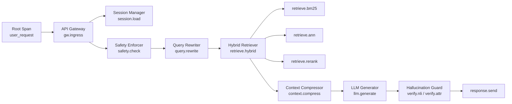
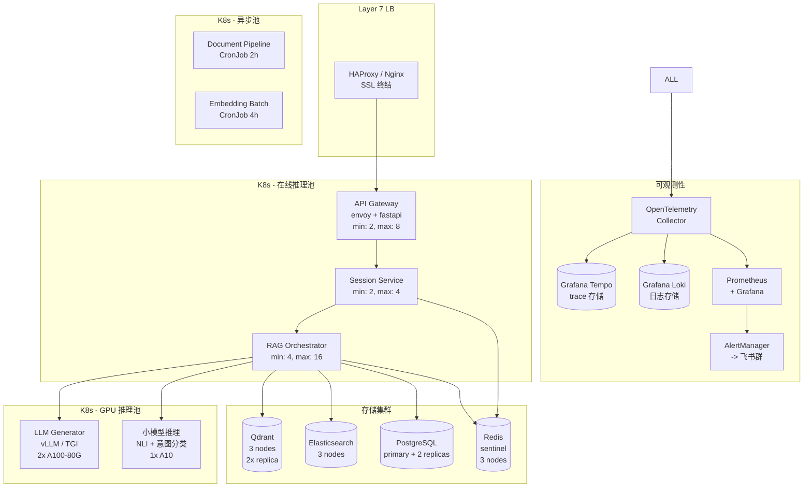

# 部署与可观测性 - 详细工程设计

> 全链路追踪、指标监控、日志聚合、告警体系。

---

## 1. OpenTelemetry 全链路追踪

### 1.1 Span 拓扑



### 1.2 代码示例

```python
from opentelemetry import trace
from opentelemetry.sdk.trace import TracerProvider
from opentelemetry.sdk.trace.export import BatchSpanProcessor
from opentelemetry.exporter.otlp.proto.grpc.trace_exporter import OTLPSpanExporter
from opentelemetry.instrumentation.fastapi import FastAPIInstrumentor
from opentelemetry.instrumentation.redis import RedisInstrumentor
from opentelemetry.instrumentation.httpx import HTTPXClientInstrumentor
from opentelemetry.sdk.resources import Resource, SERVICE_NAME

# 初始化
resource = Resource(attributes={
    SERVICE_NAME: "rag-cs-api",
    "deployment.environment": "production",
    "service.version": "2.1.0"
})

provider = TracerProvider(resource=resource)
processor = BatchSpanProcessor(
    OTLPSpanExporter(endpoint="http://otel-collector:4317")
)
provider.add_span_processor(processor)
trace.set_tracer_provider(provider)

tracer = trace.get_tracer(__name__)

# 使用
class TracedRetriever:
    def __init__(self):
        self.tracer = trace.get_tracer(__name__)

    async def search(self, query: str, user_context: dict) -> list:
        with self.tracer.start_as_current_span(
            "retrieve.hybrid",
            attributes={
                "query.length": len(query),
                "query.hash": hashlib.md5(query.encode()).hexdigest()[:8],
                "user.department": user_context.get("department"),
            }
        ) as span:
            # BM25
            with self.tracer.start_as_current_span("retrieve.bm25") as bm25_span:
                bm25_results = await self._bm25_search(query)
                bm25_span.set_attributes({
                    "bm25.result_count": len(bm25_results),
                    "bm25.top_score": bm25_results[0][1] if bm25_results else 0,
                })

            # ANN
            with self.tracer.start_as_current_span("retrieve.ann") as ann_span:
                ann_results = await self._ann_search(query)
                ann_span.set_attributes({
                    "ann.result_count": len(ann_results),
                    "ann.top_score": ann_results[0][1] if ann_results else 0,
                })

            # RRF 融合
            with self.tracer.start_as_current_span("retrieve.rrf_fusion") as rrf_span:
                fused = self._rrf_fusion(bm25_results, ann_results)
                rrf_span.set_attribute("rrf.fused_count", len(fused))

            # Rerank
            with self.tracer.start_as_current_span("retrieve.rerank") as rerank_span:
                reranked = self._cross_encode_rerank(query, fused)
                rerank_span.set_attributes({
                    "rerank.input_count": len(fused),
                    "rerank.output_count": len(reranked),
                    "rerank.top_score": reranked[0][2] if reranked else 0,
                })

            span.set_attribute("retrieve.final_count", len(reranked))
            return reranked
```

## 2. Prometheus 指标采集

### 2.1 指标定义

```python
from prometheus_client import Counter, Histogram, Gauge, Summary

# === 请求级指标 ===
request_total = Counter(
    "rag_request_total",
    "Total RAG requests",
    ["status", "verdict"]  # status: success/error, verdict: pass/warn/reject
)

request_duration = Histogram(
    "rag_request_duration_seconds",
    "End-to-end request duration",
    buckets=[0.1, 0.5, 1.0, 2.0, 3.0, 5.0, 8.0, 10.0, 15.0, 30.0]
)

# === 检索指标 ===
retrieval_latency = Histogram(
    "rag_retrieval_latency_seconds",
    "Retrieval latency by method",
    ["method"],  # bm25, ann, rerank, total
    buckets=[0.01, 0.05, 0.1, 0.2, 0.5, 1.0, 2.0, 5.0]
)

retrieved_chunks = Histogram(
    "rag_retrieved_chunks_total",
    "Number of retrieved chunks",
    buckets=[0, 1, 3, 5, 10, 20, 50]
)

# === 生成指标 ===
llm_tokens = Counter(
    "rag_llm_tokens_total",
    "Total LLM tokens consumed",
    ["type"]  # prompt, completion
)

llm_latency = Histogram(
    "rag_llm_latency_seconds",
    "LLM generation latency",
    ["phase"],  # first_token, total
    buckets=[0.1, 0.5, 1.0, 2.0, 5.0, 10.0, 20.0, 60.0]
)

# === 安全与质量指标 ===
hallucination_score = Histogram(
    "rag_hallucination_score",
    "Hallucination detection fused score",
    buckets=[0.2, 0.4, 0.6, 0.7, 0.8, 0.85, 0.9, 0.95]
)

safety_decisions = Counter(
    "rag_safety_decisions_total",
    "Safety enforcer decisions",
    ["action"]  # pass, append_disclaimer, queue_for_review, block
)

escalation_total = Counter(
    "rag_escalation_total",
    "Escalation triggers",
    ["reason"]  # user_request, safety_block, hallucination_reject, ...
)

# === 业务指标 ===
user_satisfaction = Gauge(
    "rag_user_satisfaction_ratio",
    "User satisfaction rate (like / total feedback)"
)

active_sessions = Gauge(
    "rag_active_sessions",
    "Currently active sessions"
)

repeat_question_rate = Gauge(
    "rag_repeat_question_rate",
    "Rate of users re-asking the same topic"
)
```

### 2.2 中间件自动采集

```python
from fastapi import FastAPI, Request
import time

app = FastAPI()

@app.middleware("http")
async def prometheus_middleware(request: Request, call_next):
    start = time.time()
    response = await call_next(request)
    duration = time.time() - start

    # 记录请求指标
    request_duration.observe(duration)
    request_total.labels(
        status="success" if response.status_code < 400 else "error",
        verdict=getattr(request.state, "verdict", "unknown")
    ).inc()

    return response
```

## 3. Grafana 告警规则

### 3.1 关键告警

```yaml
# prometheus-alerts.yml

groups:
  - name: rag_critical
    rules:
      # P0: 服务完全不可用
      - alert: RAGServiceDown
        expr: up{job="rag-cs-api"} == 0
        for: 1m
        labels:
          severity: critical
        annotations:
          summary: "RAG 服务不可用"
          
      # P1: P99 延迟过高
      - alert: RAGHighLatency
        expr: |
          histogram_quantile(0.99,
            rate(rag_request_duration_seconds_bucket[5m])
          ) > 8
        for: 5m
        labels:
          severity: warning
        annotations:
          summary: "RAG P99 延迟超过 8 秒"
          
      # P1: 幻觉率过高
      - alert: HighHallucinationRate
        expr: |
          rate(rag_hallucination_score_bucket{le="0.6"}[1h])
          /
          rate(rag_hallucination_score_bucket{le="+Inf"}[1h])
          > 0.05
        for: 1h
        labels:
          severity: warning
        annotations:
          summary: "幻觉率超过 5%（最近1小时）"
          
      # P1: 检索召回失败率高
      - alert: LowRetrievalRecall
        expr: rag_retrieved_chunks_total == 0
        for: 5m
        labels:
          severity: warning
        annotations:
          summary: "检索连续返回 0 结果"
          
      # P2: LLM Token 超预算
      - alert: LLMTokenBudgetExceeded
        expr: |
          sum(rate(rag_llm_tokens_total[1d])) * 86400 > 1.2 * 5000000
        for: 1h
        labels:
          severity: info
        annotations:
          summary: "每日 LLM Token 消耗超过预算 120%"
          
      # P2: 转接率异常
      - alert: AbnormalEscalationRate
        expr: |
          (
            rate(rag_escalation_total[30m])
            /
            rate(rag_request_total[30m])
          ) > 0.25
        for: 15m
        labels:
          severity: warning
        annotations:
          summary: "转接率超过 25%，可能系统异常"

  - name: rag_infra
    rules:
      - alert: HighGPUUtilization
        expr: nvidia_gpu_utilization > 90
        for: 10m
        labels:
          severity: warning
        annotations:
          summary: "GPU 使用率 > 90%"

      - alert: RedisMemoryHigh
        expr: redis_memory_used_bytes / redis_memory_max_bytes > 0.85
        for: 5m
        labels:
          severity: warning
        annotations:
          summary: "Redis 内存使用率 > 85%"
```

## 4. 日志规范

### 4.1 结构化日志

```python
import structlog
from structlog.contextvars import bind_contextvars, clear_contextvars

# 初始化
structlog.configure(
    processors=[
        structlog.stdlib.filter_by_level,
        structlog.contextvars.merge_contextvars,
        structlog.stdlib.add_log_level,
        structlog.processors.TimeStamper(fmt="iso"),
        structlog.processors.StackInfoRenderer(),
        structlog.processors.format_exc_info,
        structlog.processors.JSONRenderer()
    ],
    logger_factory=structlog.stdlib.LoggerFactory(),
    cache_logger_on_first_use=True,
)

logger = structlog.get_logger()

# 使用
class RAGOrchestrator:
    async def handle(self, request):
        # 请求级绑定上下文
        bind_contextvars(
            trace_id=request.trace_id,
            session_id=request.session_id,
            user_id=request.user_id
        )

        logger.info("request.start",
                     query=request.query[:200],
                     user_dept=request.user_context.get("department"))

        try:
            # ... 处理逻辑 ...

            logger.info("request.complete",
                         verdict=result.verdict,
                         chunks_retrieved=len(result.chunks),
                         total_latency_ms=result.latency_ms,
                         tokens_used=result.tokens_used)

        except Exception as e:
            logger.error("request.error",
                          error_type=type(e).__name__,
                          error_message=str(e)[:500])
            raise
        finally:
            clear_contextvars()
```

### 4.2 日志级别规范

| 级别 | 场景 |
|---|---|
| ERROR | 请求失败、关键组件不可用、数据损坏 |
| WARNING | 降级行为（如 NLI 不可用降级到仅归因）、预算超 90% |
| INFO | 每次请求的生命周期事件（请求开始/结束）、配置变更 |
| DEBUG | 各阶段的中间结果（检索分数、压缩输出）、开发环境使用 |

## 5. 部署拓扑



## 6. 配置管理

```yaml
# config/production.yaml
service:
  name: rag-cs-api
  version: "2.1.0"
  port: 8000

rag:
  query_rewriter:
    model: qwen2.5-7b-instruct
    max_history_rounds: 5
    summary_max_chars: 80
    cache_ttl_seconds: 3600

  retriever:
    bm25:
      timeout_ms: 200
      size: 100
    ann:
      timeout_ms: 400
      size: 100
    rrf:
      k_value: 60
    reranker:
      model: bge-reranker-v2-m3
      batch_size: 32
      max_input_length: 8192
    dynamic_top_k:
      min_k: 3
      max_k: 20
      score_threshold: 0.3

  compressor:
    dedup_threshold: 0.95
    target_tokens: 3000
    trim_chunk_max_tokens: 500

  hallucination_guard:
    nli_model: Alibaba-NLP/gte-Qwen2-7B-instruct
    attribution_model: qwen2.5-7b-instruct
    weights:
      nli: 0.45
      attribution: 0.35
      uncertainty: 0.20
    thresholds:
      green: 0.85
      yellow: 0.60

safety:
  wordlist_reload_interval_seconds: 60
  classifier_timeout_ms: 1500
  audit_log_retention_days: 365

llm:
  generator:
    model: qwen2.5-72b-instruct
    endpoint: http://vllm-generator:8000/v1
    max_tokens: 1024
    temperature: 0.1
    request_timeout_ms: 15000
  small:
    model: qwen2.5-7b-instruct
    endpoint: http://vllm-small:8000/v1
    max_tokens: 500
    request_timeout_ms: 3000

redis:
  url: redis-sentinel:26379
  db: 0

postgres:
  url: postgresql://primary:5432/rag_cs
  pool_size: 20

observability:
  otel_endpoint: http://otel-collector:4317
  log_level: INFO
```

---

> 返回: [README.md](../../README.md) | [01-system-architecture.md](01-system-architecture.md)
